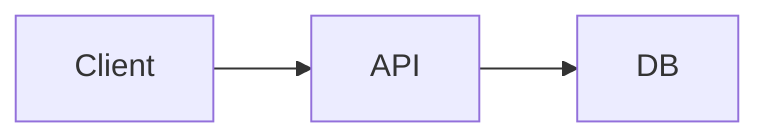

# SUPERSEDED

This spec is superseded by the v0.5.0 plugin implementation at `plugins/bizar/src/{commands.ts,commands-impl.ts,plan-fs.ts}`. See `wiki/Changelog.md` for the implementation timeline.

---


# Visual Planner v2 — Feature Spec

> **Status:** Draft for Forseti audit. v1 (basic markdown editor + flat comments) is implemented. v2 is a full rewrite of the editor around a component library, real-time UX, threads, templates, multi-file plans, and exports.
> **Goal:** Turn a "plan file" from a static MDX document into a living, interactive workspace that is pleasant to author, comment on, and ship.

---

## Changelog (v0.1 → v2)

v1 is `cli/plan.mjs` (652 LOC), `templates/plan.html.template` (1039 LOC), and `templates/plan.mdx.template` (46 LOC). The contract is:

- `plan.mdx` is a hand-rolled MDX-like document parsed by a hand-rolled renderer.
- Comments are flat (no replies), stored in `comments.json` as a flat array.
- Edit mode swaps the rendered section content for a `<textarea>` — no rich toolbar, no live preview, no diff, no images, no templates, no threading, no export.
- The HTML viewer is self-contained but cannot load CDNs because it is `file://` and `127.0.0.1` and the user may be offline.

v2 changes the surface area. The CLI is largely unchanged; the templates and the local server are rewritten. Every v1 plan must keep working (backward compatibility is non-negotiable).

| v1 | v2 |
|---|---|
| Hand-rolled markdown renderer | `marked` via self-hosted `marked.min.js` (no CDN — bundled into the template) |
| No syntax highlighting | `highlight.js` (bundled) |
| No diagrams | `mermaid.js` (bundled, lazy-loaded) |
| Single view → swap to textareas | Split view: editor + live preview, or single view with toggle |
| No toolbar | Floating + sticky toolbar with formatting buttons + keyboard shortcuts |
| No auto-save | Debounced 1s auto-save (PUT `/api/plan` on idle) |
| No diff | Side-by-side "unsaved vs saved" diff (use `diff` line-algorithm) |
| Flat comments (1 level) | Threaded comments (replies, reactions, resolve, mention) |
| No images | Paste-from-clipboard + drag-from-filesystem, stored in `attachments/` |
| No templates | Starter library (`feature-design`, `bug-investigation`, `release-plan`, `research`, `decision-record`) + user-saved templates |
| No multi-file plans | Parent/child links, plan collection index, cross-plan comments |
| Status not tracked | `meta.json.status` becomes a real field: `draft`, `in-review`, `approved`, `archived` |
| Single export (raw MDX to stdout) | Export: PDF (via headless print), standalone HTML (single file, no server), raw Markdown, shareable link (URL with b64 payload) |
| `comments.json` is a flat array | `comments.json` is `{ threads: [...] }` with backward-compat shim |

The CLI (`cli/plan.mjs`) and the runner stay almost the same. The viewer template is the bulk of the work.

---

## 1. Goals & Non-Goals

### 1.1 Goals

A v2 plan:

1. **Feels alive.** Auto-save, live preview, animated transitions, instant feedback on every action. No "Save, reload, lose scroll position" round-trips.
2. **Has real components.** Status badges, callouts, todo lists, code blocks, mermaid diagrams, tables, images, videos, file attachments, link cards, quotes, footnotes — all addable with simple syntax.
3. **Threads comments properly.** Replies (nested), reactions (emoji), resolve/unresolve, mentions (`@author`), per-section counts, filter by status, sort by date/author/reactions.
4. **Supports multi-file plans.** A plan can link to other plans (parent/child). A project can have many plans. There's an index/overview page.
5. **Has a template library.** Built-in starters (`feature-design`, `bug-investigation`, `release-plan`, `research`, `decision-record`) and user-saved templates.
6. **Exports cleanly.** PDF, standalone HTML, raw Markdown, shareable link.
7. **Surfaces a status field.** `draft`, `in-review`, `approved`, `archived` — queryable and filterable in the overview page.
8. **Stays local and single-user.** No auth, no remote, no hosted component. The "shareable link" is a self-contained encoded URL, not a hosted share.
9. **Reads v1 plans unchanged.** v1's flat `comments.json` is read and converted to v2's threaded format on first open.
10. **No build step.** The viewer is still a single HTML file (with bundled JS, not CDN). The local server stays vanilla Node `http`.

### 1.2 Non-Goals (v2)

- Real-time multi-user collaboration (Google Docs style). v2 is single-user with a local file.
- WebSocket-based live updates from external editors (VS Code, etc.). v2 has a local file watch but no remote push.
- Mobile-first UI. The viewer is desktop-first; small-screen layout works but is not optimized.
- A full WYSIWYG (no markdown at all). v2 is markdown-first with a component layer; the source is always plain text and editable.
- A hosted "bizar.dev" plan-sharing service. (That's a separate spec — see `bizar-remote-spec.md`.)
- Git-backed version control of plan content. The plan is just files; if the user wants history, they commit the plan to git like any other file. (Optional `history/` snapshots are local-only and gitignored.)
- Real-time agent orchestration inside the editor. (That's `bizar-remote`.) The v2 editor can show the status of background agents in a sidebar (read-only) if the local server can reach the opencode serve child, but it does not spawn agents.

### 1.3 Design principles

| # | Principle |
|---|---|
| 1 | **The MDX is the source of truth.** Every editor state can be serialized to a markdown file. |
| 2 | **Offline-first.** No CDN. All JS (marked, highlight, mermaid) is bundled into the template. The viewer works fully offline. |
| 3 | **Progressive enhancement.** A plain `curl /api/plan` returns the raw markdown. The viewer is a nice-to-have. |
| 4 | **Local-only privacy.** No telemetry, no analytics, no remote requests. The "shareable link" is a base64 payload, not a server round-trip. |
| 5 | **One process, one port.** The viewer, the API, and the SSE stream all live on the same `127.0.0.1:4321` server. |
| 6 | **Zero build step.** No Vite, no webpack, no Rollup. The template file is a complete HTML document with embedded `<script>` tags. |
| 7 | **Backward compatibility.** v1 plans and v1 comment shapes still work in v2. v1 features that v2 keeps (e.g., flat comments) keep their original JSON shape on disk. |

---

## 2. User Experience

### 2.1 Default view: split editor + preview

```
┌─────────────────────────────────────────────────────────────────────────────┐
│  ● draft · v2-plan-feature-x · my-feature · last edited 2 min ago · @drb0rk │
│  [✏️ Edit] [💬 7] [🗂 Templates ▾] [📤 Export ▾] [⚙ Status ▾]              │
├──────────────────────────────┬──────────────────────────────────────────────┤
│  # v2 Plan: Feature X       │  # v2 Plan: Feature X                          │
│                              │  ┌──────────────────────────────────────────┐  │
│  ## Overview                  │  │ 📋 draft  v2-plan-feature-x  @drb0rk    │  │
│  This plan describes the v2   │  └──────────────────────────────────────────┘  │
│  of feature X. It builds on   │                                                │
│  v1 with:                     │  ## Overview                                   │
│  - status badges              │  This plan describes the v2 of feature X. It  │
│  - callouts                   │  builds on v1 with:                            │
│  - mermaid diagrams           │  • status badges                               │
│  :::                          │  • callouts                                    │
│                              │  • mermaid diagrams                            │
│  ## Goals                     │                                                │
│  - [ ] Goal 1                 │  ## Goals                                      │
│  - [ ] Goal 2                 │  ☐ Goal 1                                      │
│                              │  ☐ Goal 2                                      │
│  ## Diagram                   │                                                │
│  ```mermaid                   │  ## Diagram                                    │
│  graph LR                     │  ┌──────────────────────────────────────────┐  │
│    A[Client] --> B[Server]    │  │  A[Client] ──▶ B[Server] ──▶ C[DB]      │  │
│    B --> C[DB]                │  │                                          │  │
│  ```                          │  └──────────────────────────────────────────┘  │
│                              │                                                │
│  ::: callout info             │  ┌──────────────────────────────────────────┐  │
│  This is an info callout.     │  │ ℹ️  This is an info callout.             │  │
│  :::                         │  └──────────────────────────────────────────┘  │
│                              │                                                │
│  [image: arch.png]            │               │
│                              │                                                │
│  ## Open Questions            │  ## Open Questions                             │
│  1. Question 1                │  1. Question 1                                 │
│  2. Question 2                │  2. Question 2                                 │
│                              │                                                │
│  - Add new section +         │  [Section drag-handle]   [💬 3]                │
│                              │                                                │
├──────────────────────────────┴──────────────────────────────────────────────┤
│  💾 Auto-saved 1s ago · 12 sections · 4 unresolved threads · 0 attachments  │
└─────────────────────────────────────────────────────────────────────────────┘
```

The left pane is a monospace `<textarea>` per section (or one global `<textarea>` in single-pane mode). The right pane is the rendered preview. Edits in the left pane re-render the right pane on every keystroke (debounced 150ms).

### 2.2 Single-view toggle

A "single view" toggle button collapses the right pane. The user sees either:

- **Edit mode (single view):** full-width `<textarea>` with the full plan source.
- **Preview mode (single view):** full-width rendered output.
- **Split mode (default):** editor left, preview right.

The toggle state persists in `localStorage` (key: `bizar.plan.viewMode`).

### 2.3 Editor toolbar

A sticky toolbar floats at the top of the editor pane:

```
┌──────────────────────────────────────────────────────────────────────────┐
│  [B] [I] [S] [`] [≡] [1.] [🔗] [🖼] [▤] [📞] [/]  [↶] [↷]    [✕ Discard]│
└──────────────────────────────────────────────────────────────────────────┘
   bold  it  str  code  ul  ol  link  img  table  callout  slash  undo redo
```

Each button inserts the appropriate markdown at the cursor position (or wraps the selection). `Cmd/Ctrl+B`, `Cmd/Ctrl+I`, `Cmd/Ctrl+K` (link), `Cmd/Ctrl+/` (slash menu) are keyboard shortcuts.

The `/` button opens a slash-command menu (see §4.5) that lets the user pick a component to insert by name.

### 2.4 Section drag handles

Each section in the editor has a left-edge "drag handle" (a 6-dot icon). Dragging the handle reorders the section. The drag is purely UI; the markdown source is regenerated on drop. Reordering triggers a debounced auto-save (1s).

```
│ ⋮⋮ ## Goals                              │
│ ⋮⋮ - [ ] Goal 1                          │
│ ⋮⋮ - [ ] Goal 2                          │
│ ⋮⋮                                      │
│ ⋮⋮ ## Open Questions                     │
│ ⋮⋮ 1. Question 1                         │
```

### 2.5 Comment threads

Clicking the `💬 N` button on a section opens a side panel (same as v1) but the panel now shows threads:

```
┌──────────────────────────────────────────────────────┐
│  Comments on "Goals"              [×]                │
│ ─────────────────────────────────────────────────────│
│  ⊕ Status: ⏵ Open  ⊕ Sort: Newest                    │
│  [All] [Open] [Resolved] [Mine] [@mentions]          │
│ ─────────────────────────────────────────────────────│
│  @drb0rk · 2 hours ago                       [Resolve]│
│  ┌──────────────────────────────────────────────────┐│
│  │ Should Goal 2 split into subgoals?              ││
│  │ 👍 2  🎉 1                                       ││
│  │ [Reply] [Edit] [⋯]                              ││
│  └──────────────────────────────────────────────────┘│
│   ↳ @thor · 1 hour ago                               │
│   ┌────────────────────────────────────────────────┐│
│   │ Yes — see PR #47 for the breakdown.           ││
│   │ 👍 1                                            ││
│   │ [Reply] [Edit]                                 ││
│   └────────────────────────────────────────────────┘│
│   ↳ [Reply...]                                       │
│ ─────────────────────────────────────────────────────│
│  @drb0rk · 1 hour ago                       [Resolve]│
│  ┌──────────────────────────────────────────────────┐│
│  │ Goal 1 references an out-of-date doc.            ││
│  │ ❤️ 0                                             ││
│  │ [Reply] [Edit] [⋯]                              ││
│  └──────────────────────────────────────────────────┘│
│ ─────────────────────────────────────────────────────│
│  [Write a new comment... ⌘+Enter to submit]          │
│  [@ to mention · :smile: for emoji · / to insert]   │
└──────────────────────────────────────────────────────┘
```

Threads can be:

- **Open** (default) — bold, normal background.
- **Resolved** — greyed out, collapsed to a one-line summary, click to expand.
- **Pinned** — gold star icon, always at top.

The top of the panel has filters (`All`, `Open`, `Resolved`, `Mine`, `@mentions`) and a sort selector (`Newest`, `Oldest`, `Most reactions`, `Most replies`).

### 2.6 Plan overview page (multi-file plans)

When a project has multiple plans, an overview page at `http://localhost:4321/` lists them all:

```
┌────────────────────────────────────────────────────────────────────────────┐
│  Bizar Plans — BizarHarness  (5 plans · 2 drafts · 1 in-review · 2 approved)│
│                                                                            │
│  [All]  [Drafts]  [In Review]  [Approved]  [Archived]   [🆕 New plan ▾]    │
│                                                                            │
│  ● draft     v2-plan-feature-x          @drb0rk  2m ago    4 open threads │
│  ● draft     bug-investigation-mcp      @thor    3h ago    0               │
│  ◐ in-review plugin-v0.4.2-audit        @forseti 1d ago    1               │
│  ✓ approved  background-agents-spec     @tyr     1w ago    0               │
│  ✓ approved  comment-system-v2          @thor    2w ago    0               │
└────────────────────────────────────────────────────────────────────────────┘
```

Click a plan → opens it (transitions to the editor for that plan). Click `🆕 New plan ▾` → shows a template picker (built-in templates + user-saved templates).

### 2.7 Status changes

A `⚙ Status ▾` button in the editor header opens a small popover:

```
   ⏺ Status
   ─────────────
   ● Draft         (current)
   ◐ In Review
   ✓ Approved
   🗄 Archived
```

Selecting a status updates `meta.json.status` and broadcasts an SSE event so the overview page updates live.

### 2.8 Export menu

A `📤 Export ▾` button opens:

```
   📤 Export
   ─────────────
   📄 PDF                 (browser print → save as PDF)
   🌐 Standalone HTML     (single file, all CSS+JS inlined, no server)
   📝 Raw Markdown        (downloads plan.mdx)
   🔗 Shareable Link      (copies b64-encoded URL to clipboard)
   📋 Copy as MDX         (copies to clipboard)
   🖼 PNG snapshot        (renders preview to <canvas> via dom-to-image)
```

### 2.9 Slash command menu

Typing `/` at the start of a new line in the editor opens a floating menu:

```
   /
   ┌────────────────────────────────────┐
   │ 🔍  Type a component name...       │
   ├────────────────────────────────────┤
   │ 📋  Status badge        /status    │
   │ ℹ️   Callout (info)     /callout   │
   │ ⚠️   Callout (warn)     /callout-w │
   │ ❌   Callout (danger)   /callout-d │
   │ ✅   Callout (success)  /callout-s │
   │ ☑️   Todo list          /todo      │
   │ 📊   Table (sortable)   /table     │
   │ 🖼   Image              /image     │
   │ 🎬   Video              /video     │
   │ 📎   File attachment    /file      │
   │ 🔗   Link card          /link      │
   │ 💬   Quote              /quote     │
   │ ¹    Footnote           /footnote  │
   │ 📊   Mermaid diagram    /mermaid   │
   │ ─── ─────────────────── ───────── │
   │ ⏺   Code block (lang)   /code      │
   │ ─── ─────────────────── ───────── │
   │ 🗂   Section            /section   │
   │ ❓   Question           /question  │
   │ 📌   Decision record    /adr       │
   └────────────────────────────────────┘
```

Selecting an item inserts the component's markdown skeleton at the cursor. For example, `/callout` inserts:

```markdown
::: callout info
Write your message here.
:::
```

with the cursor placed inside the callout body.

### 2.10 The end-to-end flow

```bash
# 1. Create a plan from a template
bizarharness plan new feature-x --template feature-design

# 2. Browser opens to http://localhost:4321/feature-x/
#    → split editor + preview is visible
#    → auto-save starts immediately
#    → user types, preview re-renders

# 3. Add a comment
#    → click 💬 on a section
#    → side panel opens
#    → type comment, hit ⌘+Enter
#    → thread appears below

# 4. Insert a callout via slash menu
#    → type /, select "Callout (info)"
#    → skeleton inserted
#    → preview updates instantly

# 5. Paste a screenshot
#    → ⌘+V in editor
#    → image saved to attachments/, markdown inserted

# 6. Change status
#    → ⚙ Status ▾ → In Review
#    → meta.json updated, SSE broadcasts

# 7. View overview
#    → http://localhost:4321/ (no slug)
#    → all plans listed, status visible

# 8. Export to PDF
#    → 📤 Export ▾ → PDF
#    → browser print dialog opens
#    → user saves as plan-feature-x.pdf
```

---

## 3. File Structure

### 3.1 Per-plan directory

```
plans/<slug>/
├── plan.mdx          # source of truth (in git)
├── plan.html         # auto-generated viewer (gitignored)
├── meta.json         # metadata: title, status, author, timestamps, etc. (in git)
├── comments.json     # threaded comment data (gitignored, see §5.2)
├── attachments/      # binary blobs (gitignored)
│   ├── 2026-06-17-arch.png
│   ├── 2026-06-17-screenshot-1.png
│   └── 2026-06-17-design.pdf
└── history/          # optional local snapshots (gitignored)
    └── 2026-06-17T14-30-00.json
```

`.gitignore` additions (CLI prompts the first time `plan new --v2` is run):

```
plans/*/plan.html
plans/*/comments.json
plans/*/attachments/
plans/*/history/
```

If the user wants comments in git, they remove the `comments.json` line manually.

### 3.2 Template library

The CLI ships a template library at `templates/plan/library/`:

```
templates/plan/
├── plan.html.template          # the v2 viewer (much larger than v1)
├── plan.mdx.template           # the empty default starter
├── meta.json.template          # starter meta
├── library/
│   ├── feature-design.mdx      # /templates/plan/library/feature-design.mdx
│   ├── bug-investigation.mdx
│   ├── release-plan.mdx
│   ├── research.mdx
│   └── decision-record.mdx
└── assets/
    ├── marked.min.js           # bundled markdown renderer
    ├── highlight.min.js        # bundled syntax highlighter
    ├── mermaid.min.js          # bundled diagram renderer (lazy-loaded)
    └── diff.js                 # line-diff algorithm (small, ~3kb)
```

User-saved templates live in `~/.config/bizarharness/plan-templates/`:

```
~/.config/bizarharness/plan-templates/
├── my-standup-template.mdx
└── postmortem-template.mdx
```

These can be referenced by filename: `bizarharness plan new foo --template ~/.config/bizarharness/plan-templates/my-standup-template.mdx` or by registered name (after `bizarharness plan template save <name>`).

### 3.3 Asset bundling

The viewer template is a single HTML file that includes all four JS libraries inlined as `<script>` tags. The total size budget is < 1.5 MB (marked ~30kb, highlight ~50kb, mermaid ~600kb, diff ~3kb, plus our own app code ~200kb). The file is regenerated every time the template changes; the CLI bakes in the assets during regeneration (no copy step needed in dev).

The libraries are vendored as `templates/plan/assets/*.min.js` and are committed to git. The CLI reads them at regeneration time and inlines them into `plan.html` via string replacement (or, for v2, by appending `<script>` blocks before `</body>`).

---

## 4. Component Library

Each component is a markdown block that renders to a specific DOM structure. Components are categorized:

- **Block components** — multi-line blocks (callouts, code, diagrams, tables, images, attachments, link cards, quotes, todos).
- **Inline components** — within a paragraph (status badges, mentions, footnotes, links).
- **Section components** — top-level (`## Section`) and sub-sections (`### Sub-section`).

### 4.1 Block component syntax

| Component | Markdown syntax | Rendered HTML (conceptual) |
|---|---|---|
| **Callout (info)** | `::: callout info\nBody text.\n:::` | `<div class="callout callout-info"><div class="callout-icon">ℹ️</div><div class="callout-body">Body text.</div></div>` |
| **Callout (warn)** | `::: callout warn\n…\n:::` | `<div class="callout callout-warn">…</div>` |
| **Callout (danger)** | `::: callout danger\n…\n:::` | `<div class="callout callout-danger">…</div>` |
| **Callout (success)** | `::: callout success\n…\n:::` | `<div class="callout callout-success">…</div>` |
| **Todo list** | `- [ ] Task 1\n- [x] Task 2` | `<ul class="todo-list"><li class="todo-pending"><input type="checkbox"> Task 1</li><li class="todo-done"><input type="checkbox" checked> Task 2</li></ul>` |
| **Code block (with language)** | ` ```ts\nconst x = 1;\n` ``` | `<pre><code class="language-ts hljs">const x = 1;\n</code></pre>` (with `highlight.js` syntax highlighting) |
| **Mermaid diagram** | ` ```mermaid\ngraph LR\n A --> B\n` ``` | `<div class="mermaid">graph LR\n A --> B\n</div>` (with `mermaid.run()` lazy-loaded) |
| **Table (sortable)** | Standard markdown table with `\| sortable` annotation on the header row | `<table class="sortable">…</table>` with click-to-sort handlers |
| **Image embed** | `` | `<figure><figcaption>alt</figcaption></figure>` |
| **Video embed** | `` | `<video controls src="/api/attachments/2026-06-17-demo.mp4"></video>` |
| **File attachment** | `[file: design.pdf](attachments/design.pdf)` | `<a class="attachment" href="/api/attachments/design.pdf" download>📎 design.pdf (123 KB)</a>` |
| **Link card (auto-preview)** | A bare URL on its own line: `\nhttps://example.com/article\n` | `<a class="link-card" href="https://example.com/article" target="_blank"><div class="link-card-title">…</div><div class="link-card-desc">…</div><div class="link-card-host">example.com</div></a>` (OG tags fetched lazily) |
| **Quote** | `> Quoted text\n> more.` | `<blockquote class="quote">…</blockquote>` |
| **Footnote** | Inline `[^1]` + def at bottom: `[^1]: Footnote text.` | `<sup class="footnote-ref"><a href="#fn-1">1</a></sup>` and `<section class="footnotes"><ol><li id="fn-1">Footnote text.</li></ol></section>` |
| **Section divider** | `---` | `<hr class="section-divider">` |
| **Status badge** (inline) | `\`[draft]\`` or `\`[✓ approved]\`` | `<span class="status-badge status-draft">draft</span>` |
| **Mention** (inline) | `@drb0rk` | `<a class="mention" href="#">@drb0rk</a>` |
| **Decision record (ADR)** | `::: adr 0001\n**Status:** Accepted\n**Date:** 2026-06-17\n\n**Context:** …\n\n**Decision:** …\n\n**Consequences:** …\n:::` | `<div class="adr adr-accepted">…</div>` |

### 4.2 Status badge

**Props:** `{ status: 'draft' | 'in-review' | 'approved' | 'archived' | 'rejected' }`

**Markdown:**

```markdown
This plan is currently `[status: in-review]`.
```

**Rendered HTML:**

```html
<span class="status-badge status-in-review">
  <span class="status-dot"></span>in-review
</span>
```

**CSS:**

```css
.status-badge {
  display: inline-flex;
  align-items: center;
  gap: 0.35em;
  padding: 0.15em 0.6em;
  font-size: 0.85em;
  font-weight: 500;
  border-radius: 999px;
  border: 1px solid currentColor;
  background: rgba(255, 255, 255, 0.05);
}
.status-badge .status-dot {
  width: 0.5em; height: 0.5em; border-radius: 50%;
  background: currentColor;
}
.status-draft     { color: #94a3b8; }
.status-in-review { color: #fbbf24; }
.status-approved  { color: #34d399; }
.status-archived  { color: #6b7280; opacity: 0.7; }
.status-rejected  { color: #f87171; }
```

### 4.3 Callout

**Props:** `{ type: 'info' | 'warn' | 'danger' | 'success' | 'note', title?: string, body: string }`

**Markdown (GitHub-style for familiarity, with `:::` as the v2 extension):**

```markdown
::: callout warn "Breaking change"
The `bizar_spawn_background` tool signature changes in v0.5. See `## Migration` below.
:::
```

**Rendered HTML:**

```html
<aside class="callout callout-warn">
  <div class="callout-icon">⚠️</div>
  <div class="callout-content">
    <div class="callout-title">Breaking change</div>
    <div class="callout-body">
      The <code>bizar_spawn_background</code> tool signature changes in v0.5. See <code>## Migration</code> below.
    </div>
  </div>
</aside>
```

**CSS (callout):**

```css
.callout {
  display: grid;
  grid-template-columns: auto 1fr;
  gap: 0.75rem;
  padding: 1rem 1.25rem;
  border-left: 4px solid;
  border-radius: 6px;
  margin: 1rem 0;
}
.callout-icon { font-size: 1.2em; line-height: 1.5; }
.callout-title { font-weight: 600; margin-bottom: 0.25rem; }
.callout-body { color: var(--color-text); }
.callout-info    { background: #eff6ff; border-color: #3b82f6; }
.callout-warn    { background: #fffbeb; border-color: #f59e0b; }
.callout-danger  { background: #fef2f2; border-color: #ef4444; }
.callout-success { background: #f0fdf4; border-color: #22c55e; }
.callout-note    { background: #f8fafc; border-color: #64748b; }
```

### 4.4 Code block with syntax highlighting

**Props:** `{ language?: string, filename?: string, content: string }`

**Markdown:**

````markdown
```ts:src/auth.ts
export async function login(user: string) {
  return db.users.find({ where: { name: user } });
}
```
````

The `ts:src/auth.ts` syntax is `language:filename` — the filename is optional and shown above the code.

**Rendered HTML:**

```html
<div class="code-block">
  <div class="code-block-header">
    <span class="code-block-lang">TypeScript</span>
    <span class="code-block-filename">src/auth.ts</span>
  </div>
  <pre><code class="language-ts hljs">
    <span class="hljs-keyword">export</span> <span class="hljs-keyword">async</span> <span class="hljs-function">function</span> login(user: <span class="hljs-type">string</span>) {
      <span class="hljs-keyword">return</span> db.users.find({ <span class="hljs-attr">where</span>: { name: user } });
    }
  </code></pre>
</div>
```

**CSS:** standard highlight.js GitHub theme; code block has rounded top corners, header has a subtle background, copy button on hover (top-right).

### 4.5 Slash command menu

When the user types `/` at the start of a line in the editor, a floating menu appears. The menu is rendered as a `<div class="slash-menu">` positioned at the caret.

**Component list (with their slash commands):**

| Slash | Component | Inserts |
|---|---|---|
| `/status` | Status badge | `[status: draft]` |
| `/callout` / `/callout-info` | Callout (info) | `::: callout info\n…\n:::` |
| `/callout-w` | Callout (warn) | `::: callout warn\n…\n:::` |
| `/callout-d` | Callout (danger) | `::: callout danger\n…\n:::` |
| `/callout-s` | Callout (success) | `::: callout success\n…\n:::` |
| `/callout-note` | Callout (note) | `::: callout note\n…\n:::` |
| `/todo` | Todo list | `- [ ] Task 1\n- [ ] Task 2` |
| `/code` | Code block | ` ```ts\n…\n` ``` |
| `/mermaid` | Mermaid diagram | ` ```mermaid\ngraph LR\n A --> B\n` ``` |
| `/table` | Table | `\| Col 1 \| Col 2 \|\n\| --- \| --- \|\n\| a \| b \|` |
| `/image` | Image | `` |
| `/video` | Video | `` |
| `/file` | File attachment | `[file: name.pdf](attachments/name.pdf)` |
| `/link` | Link card | bare URL on its own line |
| `/quote` | Quote | `> quoted text` |
| `/footnote` | Footnote | `[^1] …\n\n[^1]: footnote text` |
| `/section` | Section | `## Section Title` |
| `/subsection` | Sub-section | `### Sub-section Title` |
| `/question` | Open question | `- [ ] Question 1` (todo) |
| `/adr` | Decision record | `::: adr 0001\n…\n:::` |
| `/divider` | Section divider | `---` |

**Behavior:**

- Type `/` to open the menu at the caret.
- Filter the list as the user types.
- `↑` / `↓` to navigate, `Enter` to insert, `Esc` to close.
- The slash character is consumed (the inserted snippet does not include the `/`).
- The menu is implemented as a `<div>` positioned via `getBoundingClientRect()` on the textarea caret. The textarea is replaced with a `contenteditable` for the slash command phase, then reverted to a `<textarea>` after insertion.

### 4.6 Component list summary

| # | Component | Markdown | Block/Inline | Section? |
|---|---|---|---|---|
| 1 | Status badge | `` `[status: …]` `` | Inline | No |
| 2 | Callout | `::: callout type [title]\n…\n:::` | Block | No |
| 3 | Todo list | `- [ ]` / `- [x]` | Block | No |
| 4 | Code block | ` ```lang[:file]\n…\n` ``` | Block | No |
| 5 | Mermaid | ` ```mermaid\n…\n` ``` | Block | No |
| 6 | Table | `\| col \| col \|` | Block | No |
| 7 | Image | `` | Block | No |
| 8 | Video | `` | Block | No |
| 9 | File attachment | `[file: name](url)` | Block | No |
| 10 | Link card | bare URL on its own line | Block | No |
| 11 | Quote | `> text` | Block | No |
| 12 | Footnote | `[^n]` + def | Inline + Block | No |
| 13 | Section divider | `---` | Block | No |
| 14 | Mention | `@author` | Inline | No |
| 15 | Decision record | `::: adr N\n…\n:::` | Block | No |
| 16 | Section | `## Title` | Section | Yes |
| 17 | Sub-section | `### Title` | Section | Yes |

---

## 5. Editor Features

### 5.1 Split view vs single view

**Split (default):**

```
┌──────────────────────┬──────────────────────┐
│ Editor (50% width)   │ Preview (50% width)  │
│ monospace            │ rendered HTML        │
│ scrollable           │ scrollable           │
│ textarea per section │ sectioned HTML       │
└──────────────────────┴──────────────────────┘
```

The editor is a stack of `<textarea>` elements, one per section. The preview is the rendered output. The two scroll together (preview follows editor scroll position).

**Single view (toggle):**

- **Edit only:** full-width editor, no preview.
- **Preview only:** full-width rendered output, no editor.

**Toggle:** `Cmd/Ctrl+Shift+P` cycles through the three modes. State persists in `localStorage`.

### 5.2 Toolbar

A sticky toolbar floats at the top of the editor pane (or at the top of the page in single-edit mode). It has:

**Format buttons:** Bold, Italic, Strikethrough, Code (inline), Bullet list, Numbered list, Link, Image, Table, Callout, Slash menu, Undo, Redo.

**View buttons:** Split, Edit only, Preview only, Toggle outline.

**Plan buttons:** Templates, Export, Status, Comments (count badge).

**Save buttons:** Auto-save indicator (e.g., "Saved 1s ago" / "Saving…" / "Unsaved changes"), Manual save (`Cmd/Ctrl+S`), Discard changes.

### 5.3 Keyboard shortcuts

| Shortcut | Action |
|---|---|
| `Cmd/Ctrl+B` | Bold (selection) |
| `Cmd/Ctrl+I` | Italic (selection) |
| `Cmd/Ctrl+Shift+S` | Strikethrough (selection) |
| `Cmd/Ctrl+E` | Inline code (selection) |
| `Cmd/Ctrl+K` | Link (selection) |
| `Cmd/Ctrl+Shift+K` | Link card (paste URL) |
| `Cmd/Ctrl+/` | Slash menu (open at caret) |
| `Cmd/Ctrl+Shift+P` | Toggle split / single view |
| `Cmd/Ctrl+S` | Manual save (force) |
| `Cmd/Ctrl+Shift+S` | Save as template (prompts for name) |
| `Cmd/Ctrl+Z` | Undo |
| `Cmd/Ctrl+Shift+Z` | Redo |
| `Cmd/Ctrl+Enter` | In comment textarea: submit comment |
| `Cmd/Ctrl+Shift+Enter` | In comment textarea: submit + close panel |
| `Esc` | Close comment panel / slash menu |
| `Cmd/Ctrl+↑/↓` | Move section up/down |
| `Cmd/Ctrl+Shift+↑/↓` | Move section to top/bottom |
| `Cmd/Ctrl+L` | Toggle comment panel on current section |
| `Cmd/Ctrl+T` | Templates menu |
| `Cmd/Ctrl+E` | Export menu |

### 5.4 Auto-save

Auto-save runs on idle. The "idle" timer:

1. Starts at 0 when the user types in any `<textarea>`.
2. Resets to 0 on every keystroke.
3. Fires after 1000ms of no input.
4. Calls `PUT /api/plan` with the new content.
5. Updates the status indicator (`Saving…` → `Saved 1s ago`).

The auto-save is debounced; rapid typing does not cause rapid saves. If the user types again before the previous save completes, the save is queued and runs after the previous one finishes (no data loss).

Manual save (`Cmd/Ctrl+S`) bypasses the debounce.

### 5.5 Section drag/drop reordering

Each section in the editor has a 6-dot drag handle on the left edge. Dragging a handle reorders the section:

- The drag handle is a `<button class="drag-handle">` with `aria-label="Drag section"`.
- During drag, the section's `opacity` drops to 0.5 and a placeholder line is drawn at the new position.
- On drop, the section is moved in the markdown source by re-ordering the `## Title` headers and their bodies.
- The reorder triggers an auto-save.
- Reordering is recorded in `history/<timestamp>.json` as a "reorder" event (so the user can undo via the history panel — see §5.7).

### 5.6 Inline link/image picker

**Link picker (Cmd/Ctrl+K or button):**

A small popover appears at the caret with:

- A text input for the URL (with typeahead from recent links in the plan).
- A "Pick from attachments" button.
- A "Paste URL" button (auto-fills if the clipboard has a URL).

**Image picker:**

- A drop zone at the caret: drop a file from the filesystem, paste from clipboard, or click to open a file picker.
- The file is uploaded to `POST /api/attachments` and the response includes a URL like `/api/attachments/2026-06-17-arch.png`.
- The markdown `` is inserted with the alt text being the filename.
- A "Pick from existing attachments" button shows previously uploaded files.

### 5.7 Version history (local)

The viewer maintains a local history of the last N=50 saves (configurable). Each save writes `plans/<slug>/history/<ISO-timestamp>.json`:

```json
{
  "timestamp": "2026-06-17T14:30:00.000Z",
  "kind": "edit" | "reorder" | "comment" | "status" | "attachment" | "template",
  "summary": "Edited 'Goals' section",
  "diff": "…",  // optional, only for edits
  "snapshot": {
    "plan": "…",  // full markdown at this point
    "meta": "…",  // meta.json
    "comments": "…"  // comments.json
  }
}
```

A `🕐 History` button opens a panel showing the last 50 events. Click an event to see the diff against the current state, or click "Restore" to roll back (creates a new history entry of kind `restore`).

The history is **local-only** and gitignored. It is NOT a replacement for git; if the user wants real version control, they commit `plan.mdx` to git.

### 5.8 Diff view (current vs saved)

A "diff" button (or `Cmd/Ctrl+Shift+D`) opens a side-by-side diff of the editor content vs the last-saved content:

```
┌──────────────────────┬──────────────────────┐
│ Saved (on disk)      │ Editor (current)     │
├──────────────────────┼──────────────────────┤
│ # Plan               │ # Plan               │
│                      │                      │
│ ## Goals             │ ## Goals             │
│ - Goal 1             │ - Goal 1             │
│ - Goal 2             │ - Goal 2 (revised)   │  ← yellow
│                      │ - Goal 3             │  ← green (added)
│ ## Open Questions    │                      │  ← red (removed)
│ 1. Question 1        │ ## Open Questions    │
│                      │ 1. Question 1        │
└──────────────────────┴──────────────────────┘
```

The diff uses a small vendored line-diff algorithm (`diff.js`, ~3kb). It updates live as the user types.

If there are no unsaved changes, the diff view shows "✓ No unsaved changes" and a button to revert to the last saved state (if there are unsaved changes).

---

## 6. Comment System v2

### 6.1 Storage format

`comments.json` is a `{ threads: [...] }` object:

```json
{
  "schemaVersion": 2,
  "threads": [
    {
      "id": "t-abc123",
      "sectionId": "goals",
      "status": "open" | "resolved" | "pinned",
      "createdAt": "2026-06-17T14:30:00.000Z",
      "updatedAt": "2026-06-17T15:00:00.000Z",
      "comments": [
        {
          "id": "c-def456",
          "parentId": null,
          "author": "drb0rk",
          "text": "Should Goal 2 split into subgoals?",
          "createdAt": "2026-06-17T14:30:00.000Z",
          "reactions": {
            "👍": ["drb0rk", "thor"],
            "🎉": ["tyr"]
          },
          "mentions": ["thor"]
        },
        {
          "id": "c-ghi789",
          "parentId": "c-def456",
          "author": "thor",
          "text": "Yes — see PR #47 for the breakdown.",
          "createdAt": "2026-06-17T14:45:00.000Z",
          "reactions": { "👍": ["drb0rk"] },
          "mentions": []
        }
      ]
    }
  ]
}
```

**Backward compatibility shim:** If `comments.json` is detected as a v1 flat array (`[]`), the viewer auto-migrates on first load:

```js
function migrateV1Comments(v1) {
  return {
    schemaVersion: 2,
    threads: v1.map(c => ({
      id: 't-' + c.id || generateId(),
      sectionId: c.sectionId,
      status: 'open',
      createdAt: c.timestamp,
      updatedAt: c.timestamp,
      comments: [{
        id: c.id || generateId(),
        parentId: null,
        author: c.author,
        text: c.text,
        createdAt: c.timestamp,
        reactions: {},
        mentions: []
      }]
    }))
  };
}
```

The migration is in-place: the v1 array is replaced with the v2 object. A backup is written to `comments.v1-backup-<timestamp>.json` before the migration.

### 6.2 Threads

A **thread** is a flat list of comments, where each comment can have a `parentId` pointing to another comment in the same thread. The thread is rendered as a tree:

```
t-abc123 (open)
├── c-def456 (drb0rk, 2h ago)
│   └── c-ghi789 (thor, 1h ago) [reply]
└── c-jkl012 (tyr, 30m ago)
```

Nesting is **one level deep** (a reply to a reply is rendered as a flat "↳" line, not nested further). This keeps the UI simple and matches GitHub PR review semantics.

**Actions on a thread:**

- **Resolve** (creator or any commenter): marks the thread as `resolved`, collapses the body to a one-line summary. The thread can be "reopened" by clicking the collapsed summary.
- **Pin** (any commenter): marks the thread as `pinned`; pinned threads are always at the top of the section's comment list.
- **Delete** (creator only on their own comments, or any author for any comment if the user is the plan author): removes a comment; if it's the only comment in a thread, the thread is removed.

### 6.3 Reactions

Each comment has a `reactions: Record<emoji, author[]>` map. The user can toggle a reaction by clicking the emoji button. The full emoji list is small (8): `👍 ❤️ 🎉 😕 👀 🚀 🔥 ✅`. (Custom emojis are not supported in v2; that's a v3+ feature.)

The reaction button shows the count and a hover list of who reacted.

### 6.4 Mentions

Typing `@` in a comment textarea opens a small autocomplete popover with authors who have commented on the plan so far. Selecting an author inserts `@<author>` and adds them to the comment's `mentions` array.

Mentions are highlighted in the rendered comment (with a `@` color). The "Filter by @mentions" filter at the top of the panel shows threads where the current user is mentioned.

### 6.5 Filters and sort

At the top of the comment panel:

**Filter chips:** `All` (default), `Open`, `Resolved`, `Mine` (where I'm an author or mentioned), `@mentions` (where I'm mentioned).

**Sort dropdown:** `Newest first` (default), `Oldest first`, `Most reactions`, `Most replies`.

### 6.6 Per-section comment counts

Each section's header has a `💬 N` button. N is the count of OPEN threads on that section (resolved threads are not counted). A "show all" toggle includes resolved in the count.

### 6.7 Cross-plan comments

A comment on plan A can reference plan B with `@plan:slug` syntax. Clicking the reference opens plan B in a new tab. This is just a link in the comment text — no special storage.

### 6.8 Live updates (SSE)

When a comment is added/edited/reaction is toggled on a different browser tab (or another instance of the viewer), an SSE event is broadcast:

```
event: comment
data: {"type":"added","threadId":"t-abc123","sectionId":"goals","commentId":"c-def456"}
```

The viewer subscribes to `/api/events` and updates the relevant comment count and side panel in real time.

---

## 7. Plan Templates

### 7.1 Built-in templates

The CLI ships 5 built-in templates at `templates/plan/library/`:

**1. `feature-design.mdx`** — for designing a new feature

```markdown
# Feature: <name>

::: callout info
Status: `[status: draft]` · Author: <author> · Created: <date>
:::

## Overview

_What does this feature do? Why does it exist?_

## Goals

- [ ] Goal 1
- [ ] Goal 2

## Non-Goals

- What this feature does NOT do

## User Experience

_How does the user interact with this feature? Include mocks, flows, or text descriptions._

## Technical Design

### Architecture



### Data model

_Tables, schemas, types._

### API

_Endpoints, request/response shapes._

### Edge cases

_What could go wrong?_

## Open Questions

1. Question 1
2. Question 2

## Test plan

- [ ] Unit tests
- [ ] Integration tests
- [ ] E2E tests
- [ ] Manual QA

## Rollout

- [ ] Dev
- [ ] Staging
- [ ] Production (% rollout)
```

**2. `bug-investigation.mdx`** — for investigating a bug

```markdown
# Bug: <short description>

::: callout danger
Severity: <high/medium/low> · Reported: <date> · Reporter: <name>
:::

## Summary

_One-paragraph summary of the bug._

## Steps to reproduce

1. Step 1
2. Step 2
3. Step 3

## Expected behavior

_What should happen?_

## Actual behavior

_What actually happens?_

## Environment

- App version: <version>
- OS: <os>
- Browser: <browser>

## Root cause

::: callout warn
**Status:** `[status: in-review]`
:::

_What's causing this?_

## Fix

_Code changes, with diff._

## Test plan

- [ ] Regression test (failing case)
- [ ] Unit tests
- [ ] Manual verification

## References

- [PR #X](url)
- [Slack thread](url)
```

**3. `release-plan.mdx`** — for planning a release

```markdown
# Release: <version>

::: callout success
Target date: <date> · Release manager: <name>
:::

## Scope

### In

- [ ] Feature A
- [ ] Feature B

### Out

- Feature C (deferred to vN+1)

## Risk assessment

| Risk | Likelihood | Impact | Mitigation |
|---|---|---|---|
| …   | low/med/high | low/med/high | … |

## Rollout plan

1. Deploy to dev
2. Deploy to staging (24h soak)
3. Deploy to production (10% → 50% → 100%)

## Communication

- [ ] Internal announcement
- [ ] Customer email
- [ ] Changelog entry
- [ ] Blog post

## Rollback plan

_How do we revert?_

## Post-release

- [ ] Monitor metrics for 48h
- [ ] Customer feedback review
- [ ] Retrospective
```

**4. `research.mdx`** — for research/investigation

```markdown
# Research: <topic>

## Question

_What are we trying to find out?_

## Background

_Context, prior art, why this matters._

## Methods

_How did we investigate?_

## Findings

::: callout info
**Key finding 1:** …
:::

## Recommendations

- [ ] Recommendation 1
- [ ] Recommendation 2

## Open questions

1. Question 1

## References

- [Doc 1](url)
- [Doc 2](url)
```

**5. `decision-record.mdx`** — for an architecture decision record (ADR)

```markdown
# ADR-0001: <short title>

::: adr 0001
**Status:** `[status: proposed | accepted | rejected | superseded]`
**Date:** <date>
**Deciders:** <names>
:::

## Context

_What is the issue? What are the forces at play?_

## Decision

_What did we decide?_

## Consequences

### Positive

- …

### Negative

- …

### Neutral

- …

## Alternatives considered

### Alternative 1: <name>

- Pros: …
- Cons: …

### Alternative 2: <name>

- Pros: …
- Cons: …

## References

- [Doc](url)
```

### 7.2 User-saved templates

The user can save any plan as a template:

```bash
bizarharness plan template save <name> [<plan-slug>]
# if plan-slug is omitted, saves the most recently edited plan
```

This writes the plan's `plan.mdx` to `~/.config/bizarharness/plan-templates/<name>.mdx`.

To use a user-saved template:

```bash
bizarharness plan new <slug> --template <name>
# or
bizarharness plan new <slug> --template ~/.config/bizarharness/plan-templates/<name>.mdx
```

### 7.3 Template gallery in the CLI

```bash
bizarharness plan templates
```

Lists all built-in and user-saved templates:

```
  Built-in templates:
    feature-design        For designing a new feature
    bug-investigation     For investigating a bug
    release-plan          For planning a release
    research              For research/investigation
    decision-record       For architecture decision records

  User templates (~/.config/bizarharness/plan-templates/):
    my-standup            My team's standup template
    postmortem            Our postmortem template
```

The `new --template <name>` flag accepts a built-in name or a path to a `.mdx` file.

---

## 8. Multi-File Plans

### 8.1 Parent/child links

A plan can reference other plans in its content:

```markdown
This plan depends on:
- @plan:background-agents-spec (the parent spec)
- @plan:plugin-v0.4.2-audit (a related audit)
```

The `## Related plans` section is a convention: the viewer auto-collects all `@plan:slug` references and renders them as a list of link cards at the top of the plan. Each card has the linked plan's title, status, last-edited date.

### 8.2 Plan collections (overview page)

A "project" is just a directory of plans (`plans/`). The overview page at `http://localhost:4321/` lists all plans with their status, author, last-edited, comment counts.

The overview page has:

- **Header:** project name (from `package.json` or directory name), plan counts by status.
- **Filter chips:** All, Drafts, In Review, Approved, Archived.
- **Plan list:** each plan as a row with: status dot, title, slug, author, last-edited, open thread count.
- **New plan button:** opens a template picker dropdown (built-in + user-saved).
- **Search box:** filter by title, slug, or content (live).

### 8.3 Cross-plan comments

A comment can reference another plan via `@plan:slug` (see §6.7). The reference is a clickable link that opens the other plan in a new tab. There is no "comment on plan A from plan B" feature — cross-plan comments are just text references.

### 8.4 Project-level metadata

A new file `plans/project.json` (auto-created by the CLI on first run, optional):

```json
{
  "name": "BizarHarness",
  "description": "Norse-pantheon multi-agent system for opencode",
  "defaultStatus": "draft",
  "templates": ["feature-design", "decision-record"]
}
```

This drives the overview page's header and the new-plan dropdown's default templates.

---

## 9. Server API

The local server runs on `127.0.0.1:4321` (with fallback to 4322, 4323, etc.). All endpoints return JSON unless otherwise noted. All endpoints are unauthenticated (localhost-only).

### 9.1 Plan endpoints

| Method | Path | Purpose | Body | Response |
|---|---|---|---|---|
| `GET` | `/` | Plan overview (multi-plan) | — | HTML (overview page) |
| `GET` | `/{slug}/` | Plan editor (HTML) | — | HTML (v2 viewer with v2 markdown baked in) |
| `GET` | `/{slug}/raw.mdx` | Raw MDX source | — | text/plain |
| `GET` | `/api/plan/{slug}` | Plan content (parsed JSON) | — | `{ title, sections: [{id, title, body}], meta, attachments: [] }` |
| `PUT` | `/api/plan/{slug}` | Save plan content | `text/plain` (raw MDX) | `{ ok: true, lastEdited: ISO }` |
| `GET` | `/api/meta/{slug}` | Get meta | — | `meta.json` |
| `PUT` | `/api/meta/{slug}` | Update meta | JSON | `{ ok: true, meta }` |
| `GET` | `/api/plans` | List all plans | — | `[{ slug, title, status, author, lastEdited, openThreads, attachmentCount }]` |

### 9.2 Comment endpoints

| Method | Path | Purpose | Body | Response |
|---|---|---|---|---|
| `GET` | `/api/comments/{slug}` | Get all threads | — | `{ schemaVersion: 2, threads: [...] }` |
| `POST` | `/api/comments/{slug}/threads` | Create a thread | `{ sectionId, text }` | `{ thread }` |
| `PUT` | `/api/comments/{slug}/threads/{threadId}` | Update thread (resolve, pin) | `{ status }` | `{ thread }` |
| `POST` | `/api/comments/{slug}/threads/{threadId}/comments` | Reply to thread | `{ parentId, text, mentions }` | `{ comment }` |
| `PUT` | `/api/comments/{slug}/comments/{commentId}` | Edit comment | `{ text }` | `{ comment }` |
| `DELETE` | `/api/comments/{slug}/comments/{commentId}` | Delete comment | — | `{ ok: true }` |
| `POST` | `/api/comments/{slug}/comments/{commentId}/reactions` | Toggle reaction | `{ emoji }` | `{ reactions: { ... } }` |
| `GET` | `/api/comments/{slug}/count` | Per-section counts | — | `{ <sectionId>: <openCount> }` |

All comment mutations broadcast an SSE event: `event: comment\ndata: {type, slug, ...}`.

### 9.3 Attachment endpoints

| Method | Path | Purpose | Body | Response |
|---|---|---|---|---|
| `GET` | `/api/attachments/{slug}/{filename}` | Serve attachment | — | binary |
| `POST` | `/api/attachments/{slug}` | Upload file (multipart) | binary | `{ url, filename, size, mime }` |
| `DELETE` | `/api/attachments/{slug}/{filename}` | Delete attachment | — | `{ ok: true }` |
| `GET` | `/api/attachments/{slug}/list` | List attachments | — | `[{ filename, size, mime, uploadedAt }]` |

**Upload validation:**

- Max file size: 25 MB (configurable, `BIZAR_PLAN_MAX_ATTACHMENT_MB`).
- Allowed MIME types: `image/*`, `video/*`, `application/pdf`, `text/*`, and a few others (configurable allowlist).
- Filename is sanitized: only `a-z0-9-_.`, max 128 chars. The file is stored at `plans/<slug>/attachments/<ISO-date>-<sanitized-name>`.

### 9.4 Template endpoints

| Method | Path | Purpose | Body | Response |
|---|---|---|---|---|
| `GET` | `/api/templates` | List built-in + user templates | — | `{ builtIn: [...], user: [...] }` |
| `GET` | `/api/templates/{name}` | Get template content | — | `{ name, content }` |
| `POST` | `/api/templates/user` | Save user template | `{ name, content }` | `{ ok: true }` |
| `DELETE` | `/api/templates/user/{name}` | Delete user template | — | `{ ok: true }` |

### 9.5 History endpoints

| Method | Path | Purpose | Body | Response |
|---|---|---|---|---|
| `GET` | `/api/history/{slug}` | List history events | — | `[{ timestamp, kind, summary }]` |
| `GET` | `/api/history/{slug}/{timestamp}` | Get history event | — | `{ timestamp, kind, summary, diff, snapshot }` |
| `POST` | `/api/history/{slug}/restore` | Restore to a history event | `{ timestamp }` | `{ ok: true }` |

### 9.6 SSE stream

`GET /api/events` — Server-Sent Events. The viewer subscribes once on page load.

**Event types:**

| Event | Data | Triggered by |
|---|---|---|
| `plan` | `{ type: 'edited' \| 'meta' \| 'status' \| 'attachment', slug, ... }` | Plan edits, meta changes, status changes, attachment uploads |
| `comment` | `{ type: 'added' \| 'edited' \| 'resolved' \| 'reopened' \| 'reaction' \| 'deleted', slug, threadId?, commentId? }` | Comment mutations |
| `heartbeat` | `{}` | Every 30s (keep-alive) |

The viewer filters events by `slug` to update only the current plan (or all plans, on the overview page).

### 9.7 Export endpoints

| Method | Path | Purpose | Response |
|---|---|---|---|
| `GET` | `/api/export/{slug}.pdf` | PDF (server-side print) | `application/pdf` |
| `GET` | `/api/export/{slug}.html` | Standalone HTML (single file) | `text/html` |
| `GET` | `/api/export/{slug}.mdx` | Raw MDX | `text/plain` |
| `GET` | `/api/export/{slug}.png` | PNG snapshot of preview | `image/png` |
| `GET` | `/api/export/{slug}/share-link` | Generate b64 share link | `{ url }` |

The share link is a `data:` URL with the entire standalone HTML inlined, base64-encoded. Format: `http://localhost:4321/share#<base64>`. The `/share` route on the server decodes the payload and serves it. (No data leaves the machine.)

### 9.8 CORS

`Access-Control-Allow-Origin: *` is set on all routes (the user may be running a different port). This is safe because the server binds to `127.0.0.1` only.

---

## 10. Implementation Approach

### 10.1 The viewer is a single-file SPA

The viewer (`templates/plan/plan.html.template`) is a single self-contained HTML file. No CDN. No external network requests. All assets are inlined as `<script>` tags:

- `marked.min.js` (~30kb) — markdown parser
- `highlight.min.js` (~50kb) — syntax highlighter
- `mermaid.min.js` (~600kb) — diagram renderer (lazy-loaded via dynamic `import()` emulation)
- `diff.js` (~3kb) — line-diff algorithm
- `app.js` (~200kb) — our own application code

Total template file size: ~900kb-1.5MB depending on which libraries are inlined. The CLI inlines these at regeneration time.

The `app.js` is structured as a single IIFE (Immediately Invoked Function Expression) with internal modules separated by comment headers. It uses vanilla JS (no framework). State is managed by a simple observable pattern: a central `state` object with a `notify()` function that triggers re-renders.

### 10.2 Markdown rendering pipeline

```
User types in editor
    ↓ (debounced 150ms)
parsePlan(markdown) → AST
    ↓
renderAST(ast) → HTML
    ↓
syntaxHighlight(html) ← highlight.js
    ↓
lazyLoadMermaid()  ← if any mermaid blocks present
    ↓
attachEventHandlers()  ← links, comments, etc.
    ↓
updatePreview(html)
```

The `marked` library is configured with custom renderers for:

- `code` blocks: language detection + `highlight.js` + optional filename header.
- `blockquote` lines starting with `[!INFO]`, `[!WARN]`, `[!DANGER]`, `[!SUCCESS]`: render as callouts.
- `table` rows with `| sortable` annotation: render with click-to-sort handlers.
- Custom block-level rule for `::: callout type` and `::: adr N`.

### 10.3 State management

The viewer has a single `state` object:

```js
const state = {
  // Plan content
  plan: { title, preamble, sections: [...] },
  // Metadata
  meta: { title, slug, status, author, ... },
  // Comments
  comments: { schemaVersion: 2, threads: [...] },
  // Attachments
  attachments: [{ filename, size, mime, uploadedAt }],
  // UI state
  viewMode: 'split' | 'edit' | 'preview',
  activeSectionId: null,
  commentPanelOpen: false,
  slashMenuOpen: false,
  unsavedChanges: false,
  // Network
  lastSaved: ISO,
  sseConnected: false,
};
```

State changes go through `setState(patch)` which merges the patch and calls `notify()` to trigger re-renders. The render functions are idempotent and read from `state`.

### 10.4 Auto-save implementation

```js
let saveTimer = null;
let saveInProgress = false;
let pendingSave = null;

function scheduleAutoSave() {
  state.unsavedChanges = true;
  notify('saveStatus');
  clearTimeout(saveTimer);
  saveTimer = setTimeout(doSave, 1000);
}

async function doSave() {
  if (saveInProgress) {
    pendingSave = true;
    return;
  }
  saveInProgress = true;
  try {
    state.saveStatus = 'saving';
    notify('saveStatus');
    const md = buildMarkdown(state.plan);
    const res = await fetch(`/api/plan/${state.meta.slug}`, {
      method: 'PUT',
      headers: { 'Content-Type': 'text/plain; charset=utf-8' },
      body: md
    });
    if (!res.ok) throw new Error('Save failed: ' + res.status);
    state.lastSaved = new Date().toISOString();
    state.unsavedChanges = false;
    notify('saveStatus');
    addHistoryEvent('edit', 'Auto-save');
  } catch (err) {
    state.saveStatus = 'error: ' + err.message;
    notify('saveStatus');
  } finally {
    saveInProgress = false;
    if (pendingSave) {
      pendingSave = false;
      scheduleAutoSave();
    }
  }
}
```

### 10.5 The CLI changes minimally

The CLI (`cli/plan.mjs`) gets a few new flags and one new subcommand:

```bash
bizarharness plan new <slug> [--template <name>] [--status <status>]  # new flags
bizarharness plan open <slug> [--readonly]                             # new flag
bizarharness plan list [--status <status>]                             # new flag
bizarharness plan delete <slug>                                        # unchanged
bizarharness plan export <slug> [--format <mdx|html|pdf|png|share>]   # new flags
bizarharness plan template save <name> [<plan-slug>]                   # new subcommand
bizarharness plan template list                                         # new subcommand
bizarharness plan template delete <name>                                # new subcommand
bizarharness plan status <slug> <status>                                # new subcommand
bizarharness plan attach <slug> <file>                                  # new subcommand
bizarharness plan help
```

The CLI's job is:

1. Validate slug.
2. Create the plan directory (and `attachments/`, `history/`).
3. Read the template (built-in or user-saved).
4. Substitute variables (`{{title}}`, `{{slug}}`, `{{author}}`, `{{created}}`, `{{lastEdited}}`).
5. Write `plan.mdx`, `meta.json`, `comments.json`.
6. Bundle the assets (`marked`, `highlight`, `mermaid`, `diff`) into the template.
7. Substitute `{{planJson}}`, `{{metaJson}}`, `{{commentsJson}}`, `{{planMarkdown}}` into the HTML template.
8. Write `plan.html`.
9. Start the local server.
10. Open the browser.

Most of this is already done in v1. The new bits are:

- Bundling the assets into the template (asset inlining).
- Reading from `templates/plan/library/` for `--template` flag.
- Reading from `~/.config/bizarharness/plan-templates/` for user templates.
- Writing `attachments/` and `history/` directories.
- The new `template` and `status` and `attach` subcommands.

### 10.6 What the new server endpoints add

- `GET /api/plan/{slug}` — v1 was `/api/plan` (no slug); v2 is `/api/plan/{slug}` so the server can host multiple plans on the same port. (Backwards compat: v1's `/api/plan` returns the FIRST plan in the directory, with a `Deprecation` header.)
- `GET /api/plan/{slug}/raw.mdx` — raw MDX, for `curl` and for the export endpoints.
- `GET /api/comments/{slug}` — v1 was `/api/comments` (no slug); v2 is `/api/comments/{slug}`. Same deprecation as above.
- `POST /api/comments/{slug}/threads`, `PUT /api/comments/{slug}/threads/{threadId}`, etc. — new v2 endpoints.
- `GET/POST/DELETE /api/attachments/{slug}/...` — new v2 endpoints.
- `GET /api/templates`, `GET /api/templates/{name}`, `POST /api/templates/user`, `DELETE /api/templates/user/{name}` — new v2 endpoints.
- `GET /api/history/{slug}/...` — new v2 endpoints.
- `GET /api/export/{slug}.{pdf|html|mdx|png}` — new v2 endpoints.
- `GET /api/events` — new v2 SSE endpoint.
- `GET /` — now returns the overview page (multi-plan) instead of the first plan's editor.

The v1 endpoints stay working (with `Deprecation` headers) so that any v1 viewer that opens in a browser still functions.

---

## 11. UI Mockups (Additional)

### 11.1 Editor with toolbar expanded

```
┌─────────────────────────────────────────────────────────────────────────────┐
│ ● in-review · feature-x · my-feature · 2h ago · @drb0rk   [💬 7] [⚙ Status]│
├─────────────────────────────────────────────────────────────────────────────┤
│ [B] [I] [S] [`] [≡] [1.] [🔗] [🖼] [▤] [📞] [/] [↶] [↷] [Split ▾] [📤 ▾] │
├─────────────────────────────────┬───────────────────────────────────────────┤
│  # Feature: Authentication v2  │  # Feature: Authentication v2             │
│                                 │  ┌──────────────────────────────────────┐ │
│  ## Overview                    │  │ ◐ in-review  feature-x  @drb0rk       │ │
│  _The new auth flow._           │  └──────────────────────────────────────┘ │
│                                 │                                            │
│  ## Goals                       │  ## Overview                               │
│  - [ ] Goal 1                   │  The new auth flow.                        │
│  - [x] Goal 2 (done)            │                                            │
│                                 │  ## Goals                                  │
│  ::: callout warn "Migration"  │  ☐ Goal 1                                  │
│  The old token format is        │  ☑ Goal 2 (done)                          │
│  deprecated.                    │                                            │
│  :::                            │  ┌──────────────────────────────────────┐ │
│                                 │  │ ⚠️  Migration                        │ │
│  ## Open Questions              │  │ The old token format is deprecated.  │ │
│  1. ?                           │  └──────────────────────────────────────┘ │
│                                 │                                            │
│  [Section drag handle]          │  ## Open Questions                         │
│                                 │  1. ?                                      │
│                                 │                                            │
│                                 │  [💬 3] [↕ Move]                          │
├─────────────────────────────────┴───────────────────────────────────────────┤
│  💾 Auto-saved 1s ago · 8 sections · 7 unresolved threads · 2 attachments  │
└─────────────────────────────────────────────────────────────────────────────┘
```

### 11.2 Slash command menu open

```
┌─────────────────────────────────────────────────────────────────────────────┐
│                                                                             │
│   /                                                                            │
│   ┌─────────────────────────────────────────────────────────────────────┐   │
│   │  🔍  Type a component name...                                       │   │
│   ├─────────────────────────────────────────────────────────────────────┤   │
│   │  📋  Status badge (badge)                  /status                  │   │
│   │  ℹ️   Callout (info)                       /callout                 │   │
│   │  ⚠️   Callout (warn)                       /callout-w               │   │
│   │  ❌  Callout (danger)                     /callout-d               │   │
│   │  ✅  Callout (success)                    /callout-s               │   │
│   │  ━━━ ──────────────────────────── ─────────                        │   │
│   │  ☑️   Todo list                            /todo                    │   │
│   │  📊   Table (sortable)                     /table                   │   │
│   │  🖼   Image                                /image                   │   │
│   │  🎬   Video                                /video                   │   │
│   │  📎   File attachment                      /file                    │   │
│   │  🔗   Link card                            /link                    │   │
│   │  💬   Quote                                /quote                   │   │
│   │  ¹    Footnote                             /footnote                │   │
│   │  📊   Mermaid diagram                      /mermaid                 │   │
│   │  ━━━ ──────────────────────────── ─────────                        │   │
│   │  ⏺   Code block (lang)                     /code                    │   │
│   │  ━━━ ──────────────────────────── ─────────                        │   │
│   │  🗂   Section                              /section                 │   │
│   │  ❓   Question                             /question                │   │
│   │  📌   Decision record (ADR)                /adr                     │   │
│   └─────────────────────────────────────────────────────────────────────┘   │
│                                                                             │
└─────────────────────────────────────────────────────────────────────────────┘
```

### 11.3 Comment thread with replies

```
┌──────────────────────────────────────────────────────────────────────────┐
│  Comments on "Goals"                                       [×]           │
│ ────────────────────────────────────────────────────────────────────────│
│  [All]  [Open]  [Resolved]  [Mine]  [@mentions]                  [↕]    │
│  Sort: Newest first ▾                                                  │
│ ────────────────────────────────────────────────────────────────────────│
│  📌 @drb0rk · 2h ago                                       [Resolve]  │
│  ┌────────────────────────────────────────────────────────────────────┐│
│  │ Should Goal 2 split into subgoals?                                  ││
│  │ 👍 2 (drb0rk, thor)  🎉 1 (tyr)                                     ││
│  │ [Reply]  [Edit]  [⋯]                                                ││
│  │  ↳ @thor · 1h ago                                  [Resolve]      ││
│  │  ┌──────────────────────────────────────────────────────────────┐  ││
│  │  │ Yes — see PR #47 for the breakdown.                          │  ││
│  │  │ 👍 1 (drb0rk)                                                 │  ││
│  │  │ [Reply]  [Edit]                                                │  ││
│  │  └──────────────────────────────────────────────────────────────┘  ││
│  └────────────────────────────────────────────────────────────────────┘│
│ ────────────────────────────────────────────────────────────────────────│
│  @drb0rk · 1h ago                                          [Resolve]   │
│  ┌────────────────────────────────────────────────────────────────────┐│
│  │ Goal 1 references an out-of-date doc.                              ││
│  │ ❤️ 0                                                               ││
│  │ [Reply]  [Edit]  [⋯]                                                ││
│  └────────────────────────────────────────────────────────────────────┘│
│ ────────────────────────────────────────────────────────────────────────│
│  [Write a comment... ⌘+Enter to submit · @ to mention · :emoji: to react]│
└──────────────────────────────────────────────────────────────────────────┘
```

### 11.4 Overview page

```
┌────────────────────────────────────────────────────────────────────────────┐
│  Bizar Plans — BizarHarness                                                │
│  5 plans · 2 drafts · 1 in-review · 2 approved                             │
│                                                                            │
│  [All]  [Drafts]  [In Review]  [Approved]  [Archived]   [🆕 New plan ▾]   │
│  🔍 Search plans...                                                        │
│ ──────────────────────────────────────────────────────────────────────────│
│  ●  draft      v2-plan-feature-x           @drb0rk   2m ago   4 open      │
│  ●  draft      bug-investigation-mcp       @thor     3h ago   0            │
│  ◐  in-review  plugin-v0.4.2-audit         @forseti  1d ago   1            │
│  ✓  approved   background-agents-spec      @tyr      1w ago   0            │
│  ✓  approved   comment-system-v2           @thor     2w ago   0            │
└────────────────────────────────────────────────────────────────────────────┘
```

---

## 12. Migration from v1

### 12.1 v1 plans still work

- The v2 viewer reads v1's `plan.mdx` format unchanged.
- The v2 viewer reads v1's flat `comments.json` and migrates to threaded format on first open (with a backup).
- The v1 endpoints (`/api/plan`, `/api/comments`) still work but with `Deprecation` headers.
- v1 plans show up in the v2 overview page.

### 12.2 v2 features are opt-in per plan

A v2 plan can opt-in to v2 features by including a `schemaVersion: 2` in `meta.json` (or by the CLI writing it during `plan new`):

```json
{
  "title": "...",
  "slug": "...",
  "status": "draft",
  "schemaVersion": 2,
  "author": "...",
  "created": "...",
  "lastEdited": "..."
}
```

When `schemaVersion` is 1 (or absent), the v2 viewer uses the v1 component library (no callouts, no diagrams, no images, no threads). When it's 2, the full v2 component library is enabled.

A v1 plan can be upgraded with `bizarharness plan upgrade <slug>`:

```bash
bizarharness plan upgrade feature-x
# → reads plan.mdx (v1 format)
# → writes plan.mdx (v1 format unchanged)
# → updates meta.json to include schemaVersion: 2
# → migrates comments.json to v2 format (with backup)
# → regenerates plan.html with v2 components enabled
```

### 12.3 `comments.json` is backward-compatible

- v1 flat array is read and migrated in place.
- v2 `{ threads: [...] }` is read and used directly.
- A v1 viewer (or any tool that reads `comments.json`) sees a `{ schemaVersion: 2, threads: [...] }` object, which it cannot parse. This is a breaking change for downstream tools, but the v1 viewer is in-browser and updated alongside the CLI; no external tool should depend on the v1 format.

---

## 13. File Structure Summary

### 13.1 New files (5)

```
BizarHarness/
├── cli/
│   ├── plan.mjs                 # extended with new flags and subcommands
│   ├── plan.test.mjs            # extended with new tests
│   └── plan-templates.mjs       # template library CLI helpers (save, list, delete)
├── templates/
│   └── plan/
│       ├── plan.html.template   # the v2 viewer (replaces v1)
│       ├── plan.mdx.template    # the empty default starter
│       ├── meta.json.template   # starter meta.json with schemaVersion: 2
│       ├── library/             # built-in templates (5 .mdx files)
│       │   ├── feature-design.mdx
│       │   ├── bug-investigation.mdx
│       │   ├── release-plan.mdx
│       │   ├── research.mdx
│       │   └── decision-record.mdx
│       └── assets/              # vendored libraries
│           ├── marked.min.js
│           ├── highlight.min.js
│           ├── mermaid.min.js
│           └── diff.js
```

### 13.2 Modified files (3)

```
BizarHarness/
├── cli/
│   └── bin.mjs                  # add 'plan upgrade' and 'plan template' subcommands
├── wiki/
│   └── Plans-Command.md         # update docs to v2
└── .gitignore                   # add plans/*/attachments/ and plans/*/history/
```

### 13.3 Gitignored (added)

```
plans/*/attachments/
plans/*/history/
```

(Existing `plans/*/plan.html` and `plans/*/comments.json` lines stay.)

### 13.4 New wiki pages (2)

```
wiki/
├── Plans-Command-v2.md          # v2 docs
└── Plans-Command-Templates.md   # template library docs
```

---

## 14. Test Plan

### 14.1 Unit tests (CLI)

- `cli/plan.mjs` exports the new subcommands (`template save`, `template list`, `template delete`, `status`, `attach`).
- `new` creates the expected files (including `attachments/` and `history/` dirs).
- `new --template <name>` correctly reads from `templates/plan/library/`.
- `new --template <user-template>` correctly reads from `~/.config/bizarharness/plan-templates/`.
- `list --status <status>` filters correctly.
- `template save <name>` writes to the user-templates dir.
- `template list` returns both built-in and user templates.
- `status <slug> <status>` updates `meta.json`.

### 14.2 Unit tests (server endpoints)

- `GET /` returns the overview HTML.
- `GET /<slug>/` returns the v2 viewer HTML.
- `GET /api/plan/<slug>` returns the parsed plan JSON.
- `PUT /api/plan/<slug>` saves the plan and updates `meta.json.lastEdited`.
- `GET /api/comments/<slug>` returns the v2 threaded format.
- `POST /api/comments/<slug>/threads` creates a thread.
- `PUT /api/comments/<slug>/threads/<threadId>` updates thread status.
- `POST /api/comments/<slug>/threads/<threadId>/comments` creates a reply.
- `PUT /api/comments/<slug>/comments/<commentId>` edits a comment.
- `DELETE /api/comments/<slug>/comments/<commentId>` deletes a comment.
- `POST /api/comments/<slug>/comments/<commentId>/reactions` toggles a reaction.
- `GET /api/attachments/<slug>/list` returns the list.
- `POST /api/attachments/<slug>` uploads a file.
- `GET /api/attachments/<slug>/<filename>` serves the file.
- `GET /api/templates` returns the library.
- `GET /api/history/<slug>` returns the history list.
- `GET /api/events` opens an SSE connection and emits events.

### 14.3 Integration tests (in dev sandbox)

1. `bizarharness plan new feature-x --template feature-design` creates the expected files.
2. `curl http://localhost:4321/api/plan/feature-x` returns the parsed plan.
3. `curl -X PUT http://localhost:4321/api/plan/feature-x -d 'NEW CONTENT'` saves.
4. `curl -X POST http://localhost:4321/api/comments/feature-x/threads -d '{"sectionId":"goals","text":"hi"}'` creates a thread.
5. `curl http://localhost:4321/api/comments/feature-x` returns the thread.
6. `curl -X POST http://localhost:4321/api/attachments/feature-x -F 'file=@test.png'` uploads an image.
7. `curl http://localhost:4321/api/attachments/feature-x/2026-06-17-test.png` serves the image.
8. Open `http://localhost:4321/feature-x/` in a browser; verify the viewer renders correctly with v2 components.
9. Open `http://localhost:4321/`; verify the overview page shows all plans.

### 14.4 Manual tests (browser)

- Plan renders with v2 components (callouts, badges, mermaid, etc.).
- Split view works; toggle works.
- Toolbar buttons insert correct markdown.
- Slash command menu opens on `/` and inserts the right snippet.
- Auto-save fires after 1s of idle.
- Drag handle reorders sections.
- Comment thread can be created, replied to, resolved, reacted to.
- Status change updates meta.json.
- Export to PDF (via browser print) works.
- Export to standalone HTML produces a single-file HTML that opens correctly offline.
- Share link works in a new tab.

### 14.5 Migration tests

- v1 plan with flat `comments.json` opens correctly; comments are migrated to v2 format.
- v1 plan with v1 `meta.json` (no `schemaVersion`) opens with v1 component library.
- `bizarharness plan upgrade <slug>` upgrades a v1 plan to v2.
- v2 plan opens correctly in v2 viewer.
- v2 plan fails to open in v1 viewer (expected breaking change).

---

## 15. Open Questions

1. **Mermaid bundling size.** mermaid.min.js is ~600kb. The viewer template will be ~1.5MB total. Is this acceptable for a local-only viewer? (Alternative: lazy-load mermaid only when a `mermaid` block is in the plan. This requires splitting the asset bundle and would add ~50ms of load time when the user first views a mermaid block.) — **Lean: lazy-load on first mermaid block.**

2. **PDF generation.** Three options: (a) browser print-to-PDF (zero-cost, low-fidelity), (b) headless Chromium via `puppeteer-core` (high-fidelity, adds a 200MB dep), (c) server-side `wkhtmltopdf` (medium-fidelity, adds a system dep). For v2 we should ship (a) and document how users can install (b) or (c) if they want higher fidelity. — **Lean: ship (a) only.**

3. **Standalone HTML export.** A self-contained HTML file that opens offline. Should it include the asset libraries inlined (so it's truly offline) or link to CDNs (smaller file, requires online)? — **Lean: inline everything; size budget is 1.5MB per export, which is fine for local files.**

4. **PNG snapshot.** A `<canvas>` rendering of the preview. The `html-to-image` library is small but adds a dep. Alternative: skip PNG for v2 and only offer PDF + HTML + MDX. — **Lean: skip PNG for v2; add to v2.1 if requested.**

5. **Shareable link.** A `data:` URL with the entire HTML inlined. A 1.5MB HTML becomes a 2MB data URL. Browsers limit data URL length to ~2MB in the address bar. Workaround: copy the link to clipboard (no address bar). — **Lean: copy-to-clipboard, no address bar; document the 2MB limit.**

6. **History retention.** Configurable default 50 events, but should there be a size cap (e.g., 10MB total)? What happens when the cap is hit? — **Lean: 50 events, no size cap; document the disk usage and let the user `rm -rf` if needed.**

7. **Multi-user awareness.** v2 is single-user. But if the user opens the same plan in two tabs, they get race conditions on save (last save wins). Should we add a `localStorage` lock with a warning? — **Lean: add a soft warning ("This plan is open in another tab. Last save wins.") but no hard lock. Users who care can use OS-level file locks.**

8. **Comment mentions across plans.** Can a comment on plan A mention a user who's only commented on plan B? Right now mentions are scoped to the current plan. — **Lean: scope to current plan for v2; add global mentions in v2.1 if requested.**

9. **Status field semantics.** `draft`, `in-review`, `approved`, `archived` is the initial set. Should we add `rejected` (currently a status badge color, not a plan status)? — **Lean: add `rejected` to the plan status set.**

10. **Template customization.** User-saved templates are stored at `~/.config/bizarharness/plan-templates/`. Should they support variables (e.g., `{{author}}` like the v1 templates) or be inserted verbatim? — **Lean: variable substitution, same as v1.**

11. **Search in overview.** The search box filters by title, slug, content. Should it also match comments? — **Lean: title, slug, content for v2; comments in v2.1.**

12. **Attachments in version control.** Should attachments be opt-in to git? Some users want a "design.pdf" in git history; others don't. — **Lean: default gitignore attachments, document the override.**

13. **Drag handle on mobile.** The drag handle is hard to use on touch devices. — **Lean: add a "Move up / Move down" button as a fallback for touch.**

14. **Plan overview as a separate command.** `bizarharness plan list` is the v1 command. v2 introduces an HTML overview at `/`. Should there be a separate `bizarharness plan overview` command that opens the overview? — **Lean: keep `list` (CLI table) and add `/` (HTML overview). No new command.**

15. **Schema versioning.** `meta.json.schemaVersion` is 2. What happens if the user has a v3 plan in the future and runs the v2 viewer? — **Lean: the v2 viewer falls back to v1 components (no breaking change) if the schema version is unknown. Future viewers should do the same.**

---

## 16. Implementation Order

This is a multi-PR feature split. Total effort: 25-35 hours.

1. **Tyr:** Asset bundling infrastructure (vendoring marked, highlight, mermaid, diff) + asset inlining into the template. (~2h)
2. **Tyr:** Component library — callouts, status badges, mermaid blocks, sortable tables, code blocks with filename headers, link cards, footnotes, ADR blocks. (~6h)
3. **Tyr:** Editor v2 — split view, toolbar, slash command menu, keyboard shortcuts, section drag handles. (~5h)
4. **Thor:** Auto-save with debouncing + history snapshots + diff view. (~3h)
5. **Tyr:** Comments v2 — threaded storage, replies, reactions, resolve/pin, filters, sort, mentions, migration from v1. (~5h)
6. **Thor:** Attachments — upload, serve, paste-from-clipboard, drag-from-filesystem. (~2h)
7. **Thor:** Multi-file plans — plan overview page, status changes, SSE for cross-plan updates. (~3h)
8. **Tyr:** Templates — built-in library (5 templates), user-saved templates, CLI subcommands. (~3h)
9. **Tyr:** Export — PDF (browser print), standalone HTML (single file), raw MDX, share link (b64). (~2h)
10. **Thor:** Server endpoints (all of §9) + SSE. (~3h)
11. **Thor:** Migration tooling — `bizarharness plan upgrade`, v1 → v2 comments migration. (~1h)
12. **Heimdall:** Docs — update `wiki/Plans-Command.md`, write `wiki/Plans-Command-v2.md`, write `wiki/Plans-Command-Templates.md`. (~1h)
13. **Heimdall:** `.gitignore` updates + new test files. (~30min)
14. **Forseti:** Audit pass on the full spec before code merge. (~1h)
15. **Tyr + Thor:** End-to-end manual testing in BizarHarness-dev sandbox. (~2h)

Total: 25-35 hours, split across Tyr (complex), Thor (medium), Heimdall (docs), Forseti (audit).

---

## 17. Estimated Effort (v1 → v2)

| Phase | Owner | LOC | Hours |
|---|---|---|---|
| Asset bundling | Tyr | ~200 | 2h |
| Component library | Tyr | ~800 | 6h |
| Editor v2 | Tyr | ~1000 | 5h |
| Auto-save + history + diff | Thor | ~400 | 3h |
| Comments v2 | Tyr | ~700 | 5h |
| Attachments | Thor | ~250 | 2h |
| Multi-file + overview + SSE | Thor | ~500 | 3h |
| Templates | Tyr | ~400 | 3h |
| Export | Tyr | ~300 | 2h |
| Server endpoints | Thor | ~600 | 3h |
| Migration tooling | Thor | ~150 | 1h |
| Docs | Heimdall | ~600 | 1h |
| Test files | Tyr + Thor | ~1500 | included above |
| **Total** | | **~7400** | **~35h** |

---

## 18. Release Criteria (v2)

A v2 build is releasable ONLY if ALL of the following hold:

1. v1 plans (flat `comments.json`, no `schemaVersion`) still open and render correctly.
2. v2 plans (with `schemaVersion: 2`) render all v2 components.
3. Auto-save fires within 1s of idle and does not lose data on rapid typing.
4. Drag handle reorders sections and the markdown source is regenerated correctly.
5. Comments can be created, replied to, resolved, pinned, deleted, and have reactions toggled.
6. Status changes update `meta.json` and broadcast via SSE.
7. Attachments can be uploaded, served, listed, and deleted.
8. Templates (built-in and user-saved) can be used to create new plans.
9. Export to PDF (via browser print), standalone HTML, raw MDX, and share link all work.
10. The overview page lists all plans and updates live via SSE.
11. The local server binds to `127.0.0.1` only and has no external network requests.
12. All vendored libraries (marked, highlight, mermaid, diff) are bundled in the template — no CDN.
13. The viewer works fully offline (no network requests on load).
14. The `wiki/Plans-Command.md` and `wiki/Plans-Command-v2.md` docs are updated.
15. All unit tests pass.
16. All integration tests in the BizarHarness-dev sandbox pass.
17. All migration tests pass (v1 plan → v2 plan upgrade).
18. Forseti audit passes.
