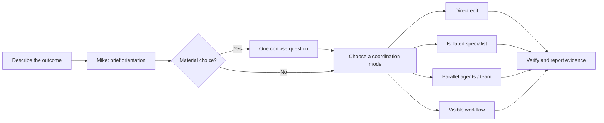
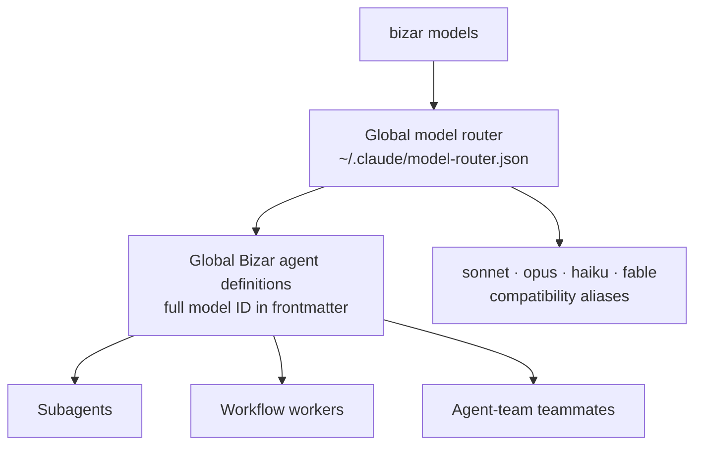

<div align="center">

```text
██████╗ ██╗███████╗ █████╗ ██████╗
██╔══██╗██║╚══███╔╝██╔══██╗██╔══██╗
██████╔╝██║  ███╔╝ ███████║██████╔╝
██╔══██╗██║ ███╔╝  ██╔══██║██╔══██╗
██████╔╝██║███████╗██║  ██║██║  ██║
╚═════╝ ╚═╝╚══════╝╚═╝  ╚═╝╚═╝  ╚═╝
```

### Guarded autonomy for Claude Code

Choose your models once. Give Claude Code real work. Bizar supplies the routing,
specialists, guardrails, and evidence to carry it through responsibly.

`84 agents` · `80 skills` · `33 commands` · `14-tool MCP server`

</div>

---

## Why Bizar?

Claude Code is already powerful. Bizar makes longer, cross-cutting work easier
to trust and easier to follow. It starts with a small read-only orientation,
forms an agent team by default for substantive work, and asks a clarification
only when a material decision remains unresolved. `/quick` deliberately
selects direct primary-session work; workflows and single agents are explicit
or resumed modes.

It keeps the operator in control of model selection and high-impact actions.
Your configured model choices live in your global Claude configuration—not in
the project you happen to be working on.

| You want | Bizar provides |
| --- | --- |
| A clean way to begin | A guided installer and `bizar models` picker |
| Your own gateway models | Global selection, full-ID subagent definitions, and native alias mapping |
| Useful parallel work | Isolated worktrees, scoped tasks, and specialist roles |
| Fewer surprises | Explicit safety checks for releases, publication, deployment, pushes, and destructive operations |
| Confidence at the end | Tests, architecture checks, E2E checks, and evidence-aware handoff |

## Start here

Install Bizar globally, install its Claude Code integration, then choose the
models you want Bizar to use.

```sh
npm install -g @polderlabs/bizar
bizar install
bizar models
```

Restart Claude Code after installation. The installer adds Bizar's agents, skills, commands, hooks, settings, and the
default OpenKan planning runtime to your user-level Claude configuration.
Claude Code itself is installed with Anthropic's native installer; npm is used
for Bizar and OpenKan, not for the Claude Code CLI.
It preserves your configured gateway endpoint and credential values during a
clean reinstall.

On a new interactive install, Bizar also asks for an optional default model,
whether Claude Code agent teams should be enabled, the OpenKan install
directory, and whether the current project should receive a `.ok/` workspace.
OpenKan is installed from npm as `@polderlabs/openkan@latest`; its package-owned
agent and skill are installed into the same Claude configuration. Use
`bizar install --yes` for CI or a prompt-free refresh.

For a completely fresh Bizar-managed Claude setup while retaining endpoint and
authentication settings:

```sh
bizar install --force
bizar models
```

Then open any repository in Claude Code and describe the outcome you want.
Mike—the Bizar coordinator—handles the rest.

> **Tip:** Run `bizar doctor` whenever you want to verify that the global
> install, Claude settings, hooks, skills, agents, and provider connection are
> healthy.

## The first-task experience



The coordinator does not force every request through a workflow. Small,
obvious edits stay small; larger requests get only the structure they need.
Writing agents work in Git worktrees, while read-only research stays light and
foregrounded.

## Your models, everywhere Bizar dispatches

`bizar models` is the single operator-facing place to select models. It
discovers candidates from your configured gateway and writes your selections to
the global model router:

```text
~/.claude/model-router.json
```

The router is never stored in a project directory. Bizar uses the selected
models for direct subagents, workflows, and agent-team teammates.



Claude Code's native per-call model field has a small alias vocabulary. Bizar
avoids making that vocabulary a limitation: it projects each selected gateway
model into a global subagent definition whose frontmatter contains the full
model ID. The agent, workflow, and team routes use that definition. The four
native aliases are compatibility shortcuts only; they do not enable an
unselected provider or reduce your selected-model pool to four choices.

Useful inspection commands:

```sh
bizar models --list
bizar models --agent-types --json
bizar models explain todd
bizar doctor
```

## A specialist bench, not a generic swarm

Bizar ships its core coordination roles alongside 68 focused specialists for
architecture, accessibility, security, testing, documentation, performance,
language and framework review, build repair, operations, and evaluation. It
also ships 80 skills for planning, debugging, verification, review,
worktrees, and implementation practice.

The coordinator selects specialists when their expertise reduces a concrete
risk. It does not create parallel workers merely to look busy. You can inspect
the installed specialist definition names through `bizar models --agent-types
--json` and use a relevant Bizar specialist directly when needed.

```text
Core coordination                 Specialist coverage
─────────────────                 ──────────────────────────────────
Mike · research · plan            Architecture · accessibility · security
Implementation · review           Build repair · tests · documentation
Verification · integration        Frameworks · performance · operations
                                  Evaluation · product and domain analysis
```

## Guardrails that stay out of the way

Bizar is designed to be autonomous for local, reversible work and deliberate
for consequential actions.

| Category | Default behavior |
| --- | --- |
| Read, inspect, edit, test, format | Proceeds autonomously within the task scope |
| Parallel code changes | Uses isolated worktrees and scoped task ownership |
| Ambiguous material design choice | Asks one concise clarification before execution |
| Commit | Locally allowed, with a fresh simplify review reminder |
| Push, PR mutation, release, publish, deploy | Requires an explicit human decision |
| Rebase, force-push, broad destructive commands | Denied or escalated by the safety floor |

The goal is not to make Claude Code timid. It is to make its boundaries clear:
Bizar works through local implementation and verification, then stops at the
point where an external or difficult-to-reverse decision belongs to you.

## What gets installed

```text
~/.claude/
├── agents/          84 Bizar roles and specialist definitions
├── skills/          80 skill packs
├── commands/        39 slash-command surfaces
├── hooks/           routing, lifecycle, safety, evidence, and quality hooks
├── rules/           focused guidance for common development work
├── workflows/       native workflow definitions
├── settings.json    Bizar-managed Claude Code integration
└── model-router.json operator-selected model state

~/.config/bizar/
├── installed.json   install record
├── openkan/          managed @polderlabs/openkan npm runtime
├── openkan-install.json  selected OpenKan home/package settings
├── evidence/        local dispatch and verification evidence
├── telemetry/       local routing and rejected-action feedback
└── worktree-queue.json  completed worktree integration queue
```

`bizar control` is a machine-readable command boundary for optional external
interfaces. Bizar deliberately does not include an embedded browser control
plane, background daemon, or general-purpose note vault.

## Commands worth knowing

| Command | When to use it |
| --- | --- |
| `bizar install` | Install or refresh Bizar, OpenKan, and the global Claude configuration |
| `bizar openkan install` | Refresh the managed `@polderlabs/openkan` npm runtime and its agent/skill |
| `bizar openkan init` | Initialise `.ok/` planning state in the current project |
| `bizar models` | Discover and select the models Bizar may dispatch |
| `bizar doctor` | Diagnose the global installation and provider connectivity |
| `bizar validate` | Run an install-focused health check |
| `ok task` | Inspect or coordinate scoped worktree tasks (OpenKan-native) |
| `ok plan` / `ok prd` | Manage OpenKan plans and PRD goals |
| `bizar worktree-merge --all` | Review and merge completed isolated work, surfacing conflicts |
| `bizar control snapshot --json` | Read the machine-friendly current harness state |
| `bizar evidence` | Inspect local dispatch and verification evidence |

## Running Bizar from this repository

For contributors, use the repository checkout rather than the global package:

```sh
npm install
npm run build
node cli/bin.mjs install
make check
make test
make e2e
```

The verification suite covers both the code and the integration contract:

```sh
make verify-removed-surfaces
make verify-repo-structure
make check-arch
make test
make e2e
make clean-check
make check
```

## Learn more

- [Documentation index](docs/INDEX.md)
- [Architecture](docs/architecture.md)
- [Model routing decisions](docs/decisions/)
- [Durable project progress, plans, and goals](.ok/)
- [MIT license](LICENSE)

## License

MIT
