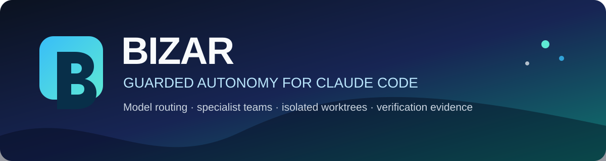
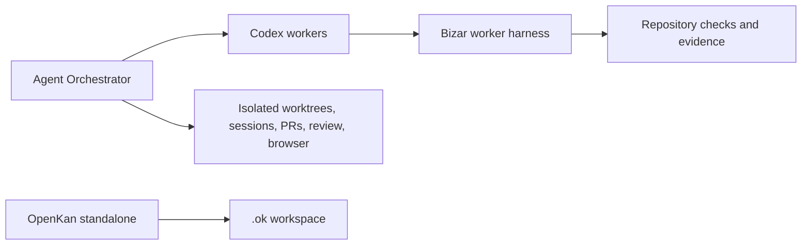
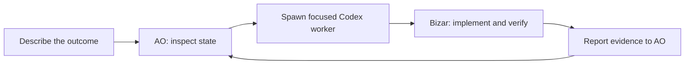
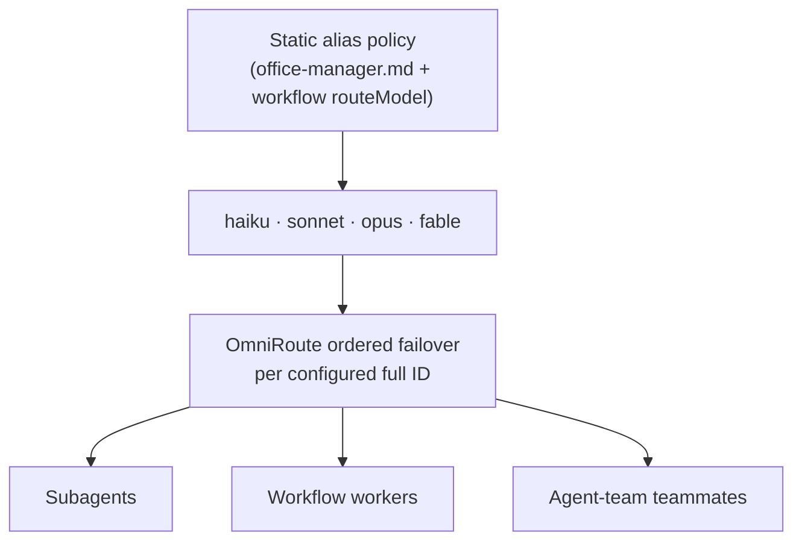
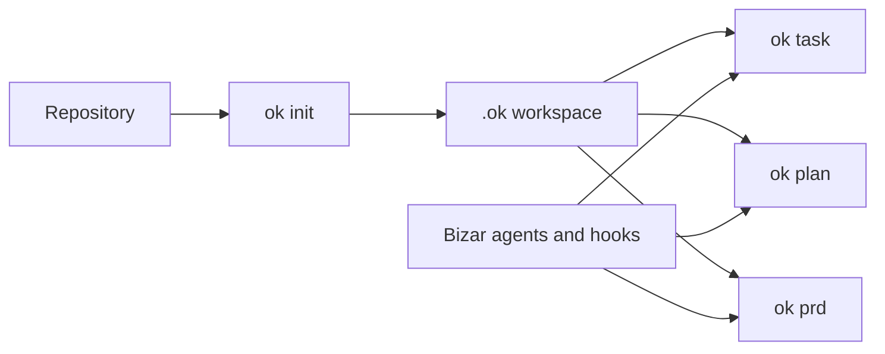

<div align="center">



[](https://www.npmjs.com/package/@polderlabs/bizar)
[](LICENSE)
[](https://github.com/Untrivial-ai/agent-orchestrator)
[](https://github.com/PolderLabsVOF/BizarHarness/releases)

[](https://www.npmjs.com/package/@polderlabs/openkan)

### Guarded autonomy for Agent Orchestrator workers

Run focused Codex workers under Agent Orchestrator. Bizar supplies their
repository policy, guardrails, skills, and verification evidence.

`85 agents` · `85 skills` · `37 commands` · `21-tool MCP server`

</div>

---

## Why Bizar?

Agent Orchestrator is built to coordinate parallel coding sessions. Bizar makes
each worker's implementation and verification discipline explicit. AO owns
multi-agent coordination, worktrees, branches, PR/review/CI feedback, previews,
and browser state; Bizar does not duplicate those surfaces.

It keeps the operator in control of model selection and high-impact actions.
AO model choices live in the registered project's AO configuration. Standalone
Claude aliases live in the global Claude configuration.

| You want | Bizar provides |
| --- | --- |
| A clean way to begin | `bizar ao setup` configures the current repository through AO's supported CLI |
| Codex workers | Versioned AO worker rules plus Bizar's repository guards and checks |
| Useful parallel work | AO-owned isolated worktrees, sessions, branches, PRs, CI/review feedback, preview, and browser tools |
| Fewer surprises | Explicit safety checks for releases, publication, deployment, pushes, and destructive operations |
| Confidence at the end | Tests, architecture checks, E2E checks, and evidence-aware handoff |

## Before you install

<table>
  <tr>
    <td width="50%"><strong>Agent Orchestrator</strong><br />Install AO from its official desktop/GitHub distribution and start its local daemon.</td>
    <td width="50%"><strong>Codex</strong><br />AO launches Codex workers and delivers Bizar's project rules through its supported configuration.</td>
  </tr>
  <tr>
    <td width="50%"><strong>OpenKan (optional)</strong><br />Use it only for standalone Bizar planning; AO is the primary lifecycle authority.</td>
    <td width="50%"><strong>Git</strong><br />AO creates the isolated worktrees and preserves normal project history.</td>
  </tr>
</table>



## Install Bizar

Install Bizar, then configure the repository with a running AO daemon.

```sh
npm install -g @polderlabs/bizar
bizar ao doctor
bizar ao setup
```

`bizar ao setup` preserves AO's existing project configuration while selecting
Codex for both AO roles and materializing Bizar's managed repository-local
worker rules at `.ao/bizar-worker-rules.md`.
AO remains responsible for spawning workers, messaging, PR claims, review/CI
follow-up, previews, and browser verification. See
[the AO integration guide](docs/agent-orchestrator.md).

## AO worker lifecycle



AO decides whether work needs one focused worker or several. Bizar workers do
not fan out a second team: they implement, test, and report evidence in their
assigned AO worktree.

## Standalone Claude Code model aliases

Bizar's four static native aliases (`haiku`, `sonnet`, `opus`, `fable`) remain
available for standalone Claude Code operation. AO workers use AO's configured
Codex model override instead. OmniRoute handles ordered failover between the
configured full gateway IDs for standalone alias dispatch, so the operator never
picks a picker-style gateway ID per agent at that layer. There is no `bizar
models` picker, no `model-router.json`, no `userSelected` block, and no
Agent-model-guard hook.

The four aliases are the entire dispatch surface:

| Alias | Use it for |
| --- | --- |
| `haiku` | Trivial, economical micro-edits |
| `sonnet` | Ordinary implementation, research, and planning |
| `opus` | Architecture, debugging, adversarial review, and high-risk work |
| `fable` | Explicit Anthropic OpenAI-compatible surfaces |

Workflow scripts (`config/workflows/*.js`) inline a tiny `dispatchAgent`
wrapper that picks the alias from a static policy; agent definitions stay
model-agnostic so the harness, not the agent, owns alias selection.



Useful inspection commands:

```sh
bizar doctor
```

## OpenKan standalone mode

OpenKan remains available when Bizar is used without AO. In AO mode, AO owns
the project/session/PR lifecycle and `.ok/` is opt-in only. In standalone mode,
OpenKan stores project-local tasks, plans, PRDs, goals, and evidence under
`.ok/` through its supported `ok` CLI boundary.



The installer can create an `.ok/` workspace for the current project. In an
existing repository, run `ok init`. Use `ok task`, `ok plan`, and `ok prd` as
the canonical commands. On OpenKan v0.5.0 and later, `ok` replaces the legacy
`openkan` command.

| Need | Command |
| --- | --- |
| Install or refresh OpenKan | `bizar openkan install` |
| Create project state | `ok init` |
| Track scoped work | `ok task` |
| Track plans and goals | `ok plan` and `ok prd` |

## A specialist bench, not a generic swarm

Bizar ships 85 agent definitions and 85 skill packs for architecture,
accessibility, security, testing, documentation, performance, build repair,
operations, planning, debugging, review, worktrees, and implementation
practice.

The coordinator selects specialists when their expertise reduces a concrete
risk. It does not create parallel workers merely to look busy.

| Coordination | Specialist coverage |
| --- | --- |
| Research, planning, implementation, review, verification | Architecture, accessibility, security, tests, documentation, performance, build repair, operations, and domain analysis |

## Guardrails that stay out of the way

Bizar is designed to be autonomous for local, reversible work and deliberate
for consequential actions.

| Category | Default behavior |
| --- | --- |
| Read, inspect, edit, test, format | Proceeds autonomously within the task scope |
| Parallel code changes | Uses isolated worktrees and scoped task ownership |
| Ambiguous material design choice | Asks one concise clarification before execution |
| Commit | Locally allowed, with a fresh simplify review reminder |
| Push, PR mutation, release, publish, deploy | Requires an explicit human decision |
| Rebase, force-push, broad destructive commands | Denied or escalated by the safety floor |

The goal is not to make Claude Code timid. It is to make its boundaries clear:
Bizar works through local implementation and verification, then stops at the
point where an external or difficult-to-reverse decision belongs to you.

## What gets installed

| Location | Contents |
| --- | --- |
| `~/.claude/` | 85 agent definitions, 85 skills, 37 command surfaces, hooks, rules, workflows, and managed settings |
| `~/.config/bizar/` | Install record, managed OpenKan runtime, evidence, telemetry, and completed-worktree queue |

`bizar control` is a machine-readable command boundary for optional external
interfaces. Bizar deliberately does not include an embedded browser control
plane, background daemon, or general-purpose note vault.

## Commands worth knowing

| Command | When to use it |
| --- | --- |
| `bizar install` | Install or refresh Bizar, OpenKan, and the global Claude configuration |
| `bizar openkan install` | Refresh the managed `@polderlabs/openkan` npm runtime and its agent/skill |
| `bizar openkan init` | Initialise `.ok/` planning state in the current project |
| `bizar doctor` | Diagnose the global installation and provider connectivity |
| `bizar validate` | Run an install-focused health check |
| `ok task` | Inspect or coordinate scoped worktree tasks (OpenKan-native) |
| `ok plan` / `ok prd` | Manage OpenKan plans and PRD goals |
| `bizar worktree-merge --all` | Review and merge completed isolated work, surfacing conflicts |
| `bizar control snapshot --json` | Read the machine-friendly current harness state |
| `bizar evidence` | Inspect local dispatch and verification evidence |

## Running Bizar from this repository

For contributors, use the repository checkout rather than the global package:

```sh
npm install
npm run build
node cli/bin.mjs install
make check
make test
make e2e
```

The verification suite covers both the code and the integration contract:

```sh
make verify-removed-surfaces
make verify-repo-structure
make check-arch
make test
make e2e
make clean-check
make check
```

## Learn more

- [Documentation index](docs/INDEX.md)
- [Architecture](docs/architecture.md)
- [Branching model](docs/branches.md) — `master` (stable) · `beta` · `dev` (nightly)
- [Versioning rules](docs/versioning.md) — per-branch semver + conventional commits
- [Development workflow](docs/development.md) — local dev + promotion + manual builds
- [npm Trusted Publishing setup](docs/trusted-publishing.md) — one-time operator config
- [Model routing decisions](docs/decisions/)
- [Durable project progress, plans, and goals](.ok/)
- [MIT license](LICENSE)

## License

MIT

---

<div align="center">
  <a href="https://polderlabs.io/"></a>
</div>
