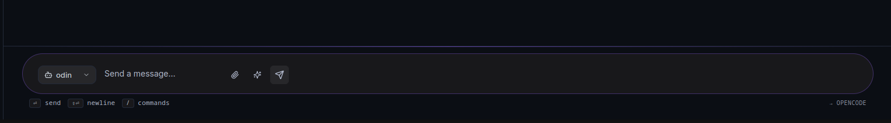
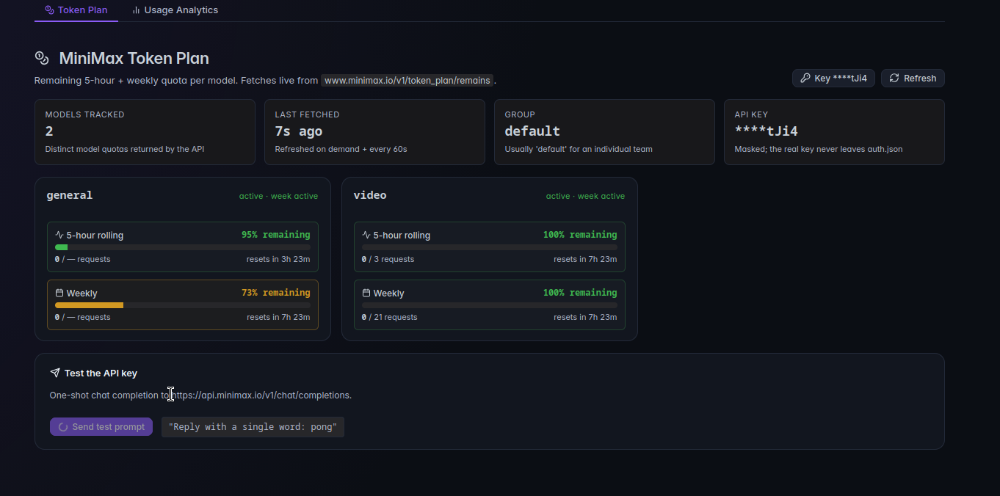

- add templates as examples in schedules users can use to create their own ones. 
- fix the chat bar sizing in this picture:
- i dont see the settings manu rework we discussed earlier.
- percentage display is like reversed or something 
- when done install the newest verison of bizar locally and deploy the dash with tailscale