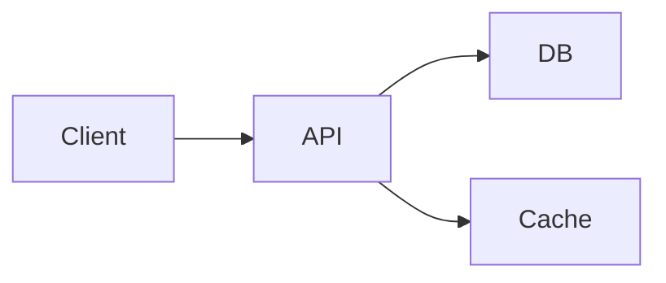

# Feature: {{title}}

**Status:** `[STATUS:draft]` · **Author:** {{author}} · **Created:** {{created}}

> [!INFO]
> This is a v2 plan with the **feature-design** template. It uses callouts
> (`> [!INFO]`, `> [!WARNING]`, etc.), status badges, and GFM task lists.
> See https://example.com for more on these conventions.

## Problem

_What problem are we solving? Why now? What happens if we don't?_

## Goals

- [ ] Goal 1 — a concrete, measurable outcome
- [ ] Goal 2 — another concrete, measurable outcome
- [ ] Goal 3 — and one more for good measure

## Non-goals

- This feature does NOT do X (deferred to a future plan)
- This feature does NOT cover Y (out of scope for this iteration)

## Design

The proposed approach. Walk through the high-level shape, then drill into specifics.

### Architecture

### Data model

Tables, schemas, types. Show diffs or new shapes.

### API

_Endpoints, request/response shapes, error handling._

### Edge cases

- What if X is empty?
- What if Y is malformed?
- What if the user is offline?

## Tradeoffs

| Option | Pros | Cons |
|--------|------|------|
| A      | Simple, easy to roll back | Limited to use case 1 |
| B      | Handles more cases       | More complex, more tests |

## Files affected

- `path/to/file.ts` — what changes and why
- `path/to/other.ts` — what changes and why
- `path/to/migration.sql` — schema changes

## Open questions

1. Question 1?
2. Question 2?
3. Question 3?

## Test plan

- [ ] Unit tests for the new module
- [ ] Integration tests for the API surface
- [ ] E2E test for the user flow
- [ ] Manual QA in staging

## Rollout

- [ ] Dev
- [ ] Staging
- [ ] Production (% rollout)

## Decision

> [!TIP]
> Pick option **A** or **B** and state the rationale here. Reference the
> Tradeoffs table above. Link to relevant docs / RFCs.

## References

- [Design doc](https://example.com/design)
- [Related plan](#)
